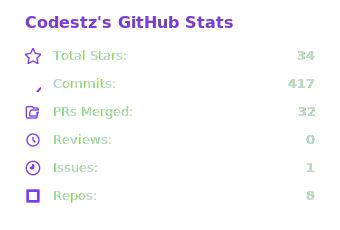
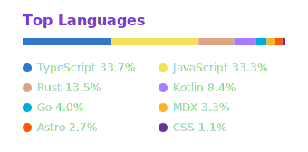
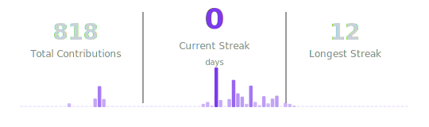
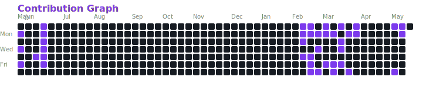

I build developer tools that make AI agents smarter.
 Rust, TypeScript, Go — CLIs, MCP servers, LSP integrations.

[codestz.dev](https://codestz.dev) / [LinkedIn](https://www.linkedin.com/in/esteban-diaz-estrada/) / [est.estrada@outlook.com](mailto:est.estrada@outlook.com)

---

<h3>What I'm focused on</h3>

<table>
<tr>
<td align="center" width="25%">
 
<b>Developer Tooling</b> 
CLIs and dev tools in Rust, Go, and TypeScript for AI-powered workflows
</td>
<td align="center" width="25%">
 
<b>AI Agent Tooling</b> 
Building the infrastructure that makes AI coding agents more capable
</td>
<td align="center" width="25%">
 
<b>MCP & LSP</b> 
Protocol-level integrations for code intelligence and AI interop
</td>
<td align="center" width="25%">
 
<b>Modern Frontend</b> 
Next.js, React 19, and React Native with performance-first approach
</td>
</tr>
</table>

---

<h3>Tech I work with</h3>

 

&nbsp;&nbsp;&nbsp;

&nbsp;&nbsp;&nbsp;

&nbsp;&nbsp;&nbsp;

&nbsp;&nbsp;&nbsp;

&nbsp;&nbsp;&nbsp;&nbsp;&nbsp;

&nbsp;&nbsp;&nbsp;

&nbsp;&nbsp;&nbsp;

&nbsp;&nbsp;&nbsp;&nbsp;&nbsp;

&nbsp;&nbsp;&nbsp;

&nbsp;&nbsp;&nbsp;

 

---

<h3>Currently</h3>

 Writing about AI-driven development @ **[codestz.dev](https://codestz.dev)**
 
 Exploring the **Claude Code** ecosystem and MCP tooling

---

### Projects

[**krait**](https://github.com/Codestz/krait) -- Code intelligence CLI for AI agents. LSP-backed symbol search, semantic editing, and diagnostics in a single Rust binary. `rust`

[**mcpx**](https://github.com/Codestz/mcpx) -- MCP servers as CLI tools. Wraps MCP servers into CLI commands for AI agents that prefer bash over JSON-RPC. `go`

[**claude-hindsight**](https://github.com/Codestz/claude-hindsight) -- Observability for Claude Code. Transforms JSONL transcripts into interactive visualizations for debugging and cost optimization. `rust`

[**codestz.dev**](https://github.com/Codestz/codestz) -- Portfolio and technical blog. Built with Next.js 16, React 19, Neo-Brutalist design. Zero human-written code. `typescript`

[**rn-alertify**](https://github.com/Codestz/rn-alertify) -- Alert notifications for React Native. Seamless integration for Android and iOS. `typescript`

[**rn-tosty**](https://github.com/Codestz/rn-tosty) -- Toast notifications and modals for React Native. Device-aware positioning, gesture-first interactions. `typescript`

---

### Writing

> I write about AI-driven development, MCP integrations, and developer tooling at **[codestz.dev](https://codestz.dev)**

<!-- BLOG-POST-LIST:START -->
- [MCP Is a Crutch: Why CLI Tools Are the Future of AI Agent Tooling](https://codestz.dev/experiments/mcpx-cli-over-mcp)
- [SPARC: The Methodology That Turns Vibe Coding Into Actual Engineering](https://codestz.dev/experiments/sparc-methodology-ai-development)
- [Spec-Driven Development: Why Writing Specs Before Code Is the Next Paradigm Shift](https://codestz.dev/experiments/spec-driven-development-tessl)
- [RTK: The Rust Binary That Slashed My Claude Code Token Usage by 70%](https://codestz.dev/experiments/rtk-rust-token-killer)
- [From Vibe Coding to Symbolic Reasoning: How Serena MCP Gives AI Agents X-Ray Vision](https://codestz.dev/experiments/serena-mcp-architectural-mastery)
- [Surgical Code Editing: The 10x Token Efficiency Pattern](https://codestz.dev/experiments/surgical-code-editing)
- [Building a Complete Portfolio Using Only AI: Zero Human Code](https://codestz.dev/experiments/building-portfolio-with-ai)
<!-- BLOG-POST-LIST:END -->

---

<picture>
  <source media="(prefers-color-scheme: dark)" srcset="./public/stats/stats-dark.svg"/>
  <source media="(prefers-color-scheme: light)" srcset="./public/stats/stats-light.svg"/>
  
</picture>
&nbsp;&nbsp;
<picture>
  <source media="(prefers-color-scheme: dark)" srcset="./public/stats/langs-dark.svg"/>
  <source media="(prefers-color-scheme: light)" srcset="./public/stats/langs-light.svg"/>
  
</picture>

 

<picture>
  <source media="(prefers-color-scheme: dark)" srcset="./public/stats/streak-dark.svg"/>
  <source media="(prefers-color-scheme: light)" srcset="./public/stats/streak-light.svg"/>
  
</picture>

 

<picture>
  <source media="(prefers-color-scheme: dark)" srcset="./public/stats/contributions-dark.svg"/>
  <source media="(prefers-color-scheme: light)" srcset="./public/stats/contributions-light.svg"/>
  
</picture>

 

