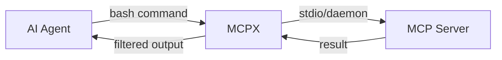

I connected 3 MCP servers to my Claude Code session. Before I typed a single prompt, **30,000 tokens were gone.** Just schemas. Just tool definitions. Serialized JSON descriptions of every function, every parameter, every type — dumped into the context window at startup.

With 10 MCP servers? Over **100,000 tokens consumed before the conversation even starts.**

That's not a tooling strategy. That's a tax.

## The Schema Bloat Crisis

MCP (Model Context Protocol) was supposed to solve tool integration for AI agents. And it does — at a cost nobody talks about. Every MCP server pre-exports its complete tool catalog into the model's context window. The model needs to "see" all tool definitions upfront to know what's available.

<TokenComparison
  title="Context Window Cost: MCP Servers at Startup"
  approaches={[
    {
      name: 'Native MCP (3 servers)',
      color: 'red',
      steps: [
        { action: 'Server 1 schema injection', tokens: 12000 },
        { action: 'Server 2 schema injection', tokens: 10000 },
        { action: 'Server 3 schema injection', tokens: 8000 },
        { action: 'Per-turn overhead (30 tools)', tokens: 3600 },
      ],
      totalTokens: 33600,
      totalCost: 'Before any work',
      successRate: '—',
    },
    {
      name: 'MCPX (same 3 servers)',
      color: 'green',
      steps: [
        { action: 'Server 1 schema injection', tokens: 0 },
        { action: 'Server 2 schema injection', tokens: 0 },
        { action: 'Server 3 schema injection', tokens: 0 },
        { action: 'Per-turn overhead', tokens: 0 },
      ],
      totalTokens: 0,
      totalCost: 'Zero upfront',
      successRate: '—',
    },
  ]}
/>

**Zero tokens upfront.** That's not a typo. MCPX loads nothing into the context window at startup. Tools are discovered on demand, called through Bash, and return only what was asked for.

## The OpenClaw Take: CLI Is the Natural Interface

Peter Steinberger, CEO of OpenClaw (formerly ClawBot), came back from three years away from coding and built an agent tool grounded in a simple thesis:

<Callout author="Peter Steinberger" role="CEO, OpenClaw" type="quote">
  MCP is a crutch. CLI excels where engineers SSH into servers, diagnose failures — it is the
  natural interface for agentic systems.
</Callout>

His argument isn't abstract. It's structural:

**MCP lacks composability.** You can't pipe MCP tool outputs. You can't chain them. A task like "find all cities over 25 degrees, then filter by population" requires multiple individual MCP calls, each serialized back into the context. CLI does this in one line with pipes.

**MCP returns everything.** A weather API call through MCP dumps temperatures, wind speeds, humidity, UV index, and 50 more fields. You needed the rain status. The model processes all of it. Tokens wasted, attention diluted.

**CLI is what developers already use.** Models are trained on shell interactions. They understand Bash. They know how to compose commands, filter output, and work within terminal constraints. MCP is a foreign protocol bolted on top.

## What Is MCPX

MCPX is a CLI proxy I built that transforms MCP servers into standard command-line tools. Instead of injecting schemas into the context window, MCPX exposes each MCP tool as a Bash command that AI agents can discover and call on demand.



The key insight: **MCP tools belong in the terminal.** The agent doesn't need a JSON schema to know what `mcpx serena search_for_pattern --substring_pattern "UserAuth"` does. It reads the command, understands the intent, and processes the output — just like any other CLI tool.

### How Discovery Works

Instead of pre-loading tool definitions, agents discover tools lazily:

<Terminal
  title="On-Demand Tool Discovery"
  lines={[
    {
      type: 'comment',
      content: '// List available servers',
    },
    {
      type: 'input',
      prompt: '$',
      content: 'mcpx list',
    },
    {
      type: 'output',
      content: 'serena (daemon) — 21 tools',
    },
    {
      type: 'divider',
      content: '',
    },
    {
      type: 'comment',
      content: '// Discover tools for a specific server',
    },
    {
      type: 'input',
      prompt: '$',
      content: 'mcpx serena --help',
    },
    {
      type: 'output',
      content: 'find_symbol, search_for_pattern, get_symbols_overview, replace_symbol_body...',
    },
    {
      type: 'divider',
      content: '',
    },
    {
      type: 'comment',
      content: '// Get detailed flags for one tool',
    },
    {
      type: 'input',
      prompt: '$',
      content: 'mcpx serena find_symbol --help',
    },
    {
      type: 'output',
      content: '--name_path_pattern (required), --include_body, --depth, --relative_path...',
    },
    {
      type: 'divider',
      content: '',
    },
    {
      type: 'comment',
      content: '// Call the tool',
    },
    {
      type: 'input',
      prompt: '$',
      content: 'mcpx serena find_symbol --name_path_pattern "UserAuth" --include_body true',
    },
    {
      type: 'success',
      content: '✓ Result returned. Only the requested data, no schema overhead.',
    },
  ]}
/>

Each `--help` call costs a handful of tokens. The agent only discovers what it needs, when it needs it. Compare this to MCP, which front-loads **every tool definition for every server** on every single turn.

## The Numbers Don't Lie

Research from multiple independent benchmarks paints a consistent picture:

| Metric                        | Native MCP | CLI Approach | Improvement |
| ----------------------------- | ---------- | ------------ | ----------- |
| Upfront token cost (30 tools) | ~30,000    | 0            | **100%**    |
| Per-turn overhead             | ~3,600     | 0            | **100%**    |
| Token reduction over 15 turns | baseline   | 96-99% fewer | **96-99%**  |
| Task completion score         | baseline   | +28% higher  | **28%**     |
| GitHub MCP (93 tools) startup | ~55,000    | 0            | **100%**    |

<Callout type="tip">
  The CLI approach doesn't just save tokens — it achieves a 28% higher task completion score with
  roughly the same total token count. Tokens are spent on actual problem-solving instead of schema
  processing.
</Callout>

The enterprise reality is even more dramatic. Twenty MCP servers exposing twenty tools each means **four hundred tool definitions** serialized into the context window. Every. Single. Turn.

## MCPX Architecture

MCPX is built in Go with zero runtime dependencies. A single binary that supports:

<ProcessFlow
  title="MCPX Design Principles"
  steps={[
    {
      title: 'Zero Context Overhead',
      description:
        'No schemas injected at startup. Tools discovered on demand via --help flags. The model context stays clean for actual work.',
    },
    {
      title: 'Daemon Mode',
      description:
        'Heavy MCP servers stay resident between calls via Unix sockets. Sub-millisecond startup time for subsequent invocations. No cold-start penalty.',
    },
    {
      title: 'Unix Composability',
      description:
        'Standard stdin/stdout pipes. Chain commands naturally. Use printf for complex JSON args. Works with every shell tool in existence.',
    },
    {
      title: 'Secure by Default',
      description:
        'Secrets resolve at runtime from OS keychains — never on disk or in logs. Strict variable parsing prevents shell injection. Direct process execution.',
    },
  ]}
/>

### Configuration

MCPX uses a two-level YAML configuration — global at `~/.mcpx/config.yml` and project-level at `.mcpx/config.yml`:

```yaml
servers:
  serena:
    command: serena
    args: ['--workspace', '${GIT_ROOT}']
    daemon: true
    env:
      API_KEY: '${keychain:serena-api-key}'
```

Dynamic variables resolve git metadata, environment variables, and OS keychain secrets automatically. The agent never sees credentials — they're resolved at the process level.

### Tool Composition

This is where CLI fundamentally wins over MCP. With MCPX, tools compose through standard Unix patterns:

<Terminal
  title="Unix Composability in Action"
  lines={[
    {
      type: 'comment',
      content: '// Pipe complex JSON args via stdin',
    },
    {
      type: 'input',
      prompt: '$',
      content:
        'printf \'{"name_path": "Auth.*", "include_body": true}\' | mcpx serena find_symbol --stdin',
    },
    {
      type: 'divider',
      content: '',
    },
    {
      type: 'comment',
      content: '// Get raw JSON for programmatic use',
    },
    {
      type: 'input',
      prompt: '$',
      content: 'mcpx serena list_dir --recursive true --relative_path src/ --json',
    },
    {
      type: 'divider',
      content: '',
    },
    {
      type: 'comment',
      content: '// Chain tool calls naturally',
    },
    {
      type: 'input',
      prompt: '$',
      content: 'mcpx serena find_symbol --name_path_pattern "handleRequest" --json | jq ".path"',
    },
    {
      type: 'success',
      content: '✓ Data flows through pipes. No context window involved.',
    },
  ]}
/>

Try doing this with MCP. Each call goes through the model, back to the server, serialized into JSON, deserialized, and injected into context. MCPX keeps data in the shell where it belongs — the model only sees what it explicitly requests.

## The Scalability Crisis MCP Can't Solve

Here's the uncomfortable truth about MCP at scale:

<Comparison
  title="MCP at Enterprise Scale"
  wrong="20 MCP servers × 20 tools each = 400 tool definitions serialized into context every turn. The context window is consumed by tool definitions before the user's question even begins. Models choke on schema processing instead of doing actual work."
  right="20 servers registered in MCPX = 0 tokens upfront. Agent discovers tools on demand. Each server call costs only the tokens for the command and its response. Context stays lean, model stays focused."
/>

Anthropic themselves recognized this problem. Their Tool Search feature loads a search index instead of every schema, dropping token usage by ~85%. But that's a band-aid on a fundamental architectural issue: **MCP's design assumes pre-loading is the only way to give models tool awareness.**

CLI doesn't make that assumption. The model already knows how to run commands and read `--help` output. There's nothing to pre-load.

## The Broader Shift

The industry is moving. Enterprise agents are shifting from prompt-based tool invocation to code execution-driven control flow. MCP is being treated as a collection of local SDKs rather than remote tools described in text. Data passes by reference through variables, with only small summaries surfacing back to the model.

MCPX sits at the leading edge of this shift. It's a bridge between AI agents and CLI-based tool access — keeping the power of MCP servers while eliminating the token overhead that makes them impractical at scale.

<Callout type="info">
  MCPX is MIT licensed and available now. It works with any MCP server and any AI agent that can run
  Bash commands. The migration from native MCP to MCPX takes minutes — same servers, same tools,
  zero token overhead.
</Callout>

## Getting Started

<Terminal
  title="Install MCPX"
  lines={[
    {
      type: 'comment',
      content: '// Install via Go',
    },
    {
      type: 'input',
      prompt: '$',
      content: 'go install github.com/Codestz/mcpx@latest',
    },
    {
      type: 'divider',
      content: '',
    },
    {
      type: 'comment',
      content: '// List your configured servers',
    },
    {
      type: 'input',
      prompt: '$',
      content: 'mcpx list',
    },
    {
      type: 'divider',
      content: '',
    },
    {
      type: 'comment',
      content: '// Explore a server',
    },
    {
      type: 'input',
      prompt: '$',
      content: 'mcpx serena --help',
    },
    {
      type: 'divider',
      content: '',
    },
    {
      type: 'comment',
      content: '// Call a tool',
    },
    {
      type: 'input',
      prompt: '$',
      content: 'mcpx serena find_symbol --name_path_pattern "main" --include_body true',
    },
    {
      type: 'success',
      content: '✓ Zero schema overhead. Tool called on demand.',
    },
  ]}
/>

## The Bottom Line

MCP solved a real problem: giving AI agents access to external tools. But its architecture — pre-load everything, serialize every schema, consume tokens on every turn — doesn't scale. Not for enterprise use cases with dozens of servers. Not for long coding sessions where context is precious. Not for agents that need to be fast and focused.

CLI is the answer. It's what developers already use. It's what models already understand. It's composable, efficient, and scales to any number of tools without touching the context window.

**MCPX makes the transition seamless.** Same MCP servers, same tool capabilities, zero token overhead. The protocol becomes invisible — your tools become CLI commands, and your agent's context stays clean for the work that actually matters.

Stop paying the schema tax. Your context window will thank you.

## Resources

- **[MCPX](https://github.com/Codestz/mcpx)** — CLI proxy for MCP servers
- **[MCPX Documentation](https://codestz.github.io/mcpx/)** — Full setup and configuration guide
- **[OpenClaw on CLI vs MCP](https://luketucker.com/openclaw-kilocode-and-why-cli-mcp/)** — Peter Steinberger's argument for CLI
- **[RTK (Rust Token Killer)](/experiments/rtk-rust-token-killer)** — Complementary token compression for shell output
- **[Serena MCP](/experiments/serena-mcp-architectural-mastery)** — LSP-powered code navigation (pairs perfectly with MCPX)
