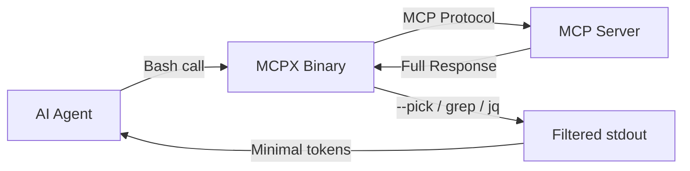

# Stop Loading 100K Tokens Just to Call a Tool

I connected an MCP server with 21 tools to Claude Code. Before the agent wrote a single line of code, it had already consumed **~80,000 tokens** just loading tool schemas into context. That's $0.60 in API costs gone before any work even started.

Then the agent called one tool. **One.**

**The entire MCP protocol is designed around a fatal assumption: that loading every tool schema upfront is acceptable.** It isn't. Not when you're paying per token. Not when context windows are finite. Not when half those schemas describe tools your agent will never touch in a given session.

So I built [MCPX](https://github.com/Codestz/mcpx) -- a secure MCP gateway that wraps any MCP server into CLI commands callable via Bash. Zero schemas in context. Zero tokens wasted. Tools called on-demand, exactly when needed.

## The Real Cost of Native MCP

Let's be concrete about what happens when you connect an MCP server the "normal" way.

<TokenComparison
  title="Token Cost: Native MCP vs MCPX"
  approaches={[
    {
      name: 'Native MCP',
      color: 'red',
      steps: [
        { action: 'Load all tool schemas', tokens: 80000, time: '0s' },
        { action: 'Agent reads schemas', tokens: 15000, time: '2s' },
        { action: 'Call find_symbol', tokens: 3000, time: '1s' },
        { action: 'Process result', tokens: 2000, time: '0.5s' },
      ],
      totalTokens: 100000,
      totalCost: '$0.75',
      successRate: '100%',
    },
    {
      name: 'MCPX',
      color: 'green',
      steps: [
        { action: 'Load schemas', tokens: 0, time: '0s' },
        { action: 'Call mcpx serena find_symbol', tokens: 500, time: '0.005s' },
        { action: 'Process result', tokens: 2000, time: '0.5s' },
      ],
      totalTokens: 2500,
      totalCost: '$0.02',
      successRate: '100%',
    },
  ]}
/>

That's a **97% reduction** in token usage for the same operation. And it compounds. Every conversation, every session, every tool call -- the savings stack up.

But the cost problem doesn't stop at schema loading. There's a deeper issue that nobody talks about: **with native MCP, you have zero control over what data reaches the agent.**

## The Filtering Problem Raw MCP Can't Solve

Here's the scenario that made me realize native MCP isn't enough. An agent calls `find_symbol` looking for a class name. The MCP server returns a JSON response with 50 matches -- full file paths, line numbers, symbol kinds, parent scopes, docstrings, source bodies. Thousands of tokens of data dumped straight into the context window.

The agent only needed the name of the first match.

**With native MCP, there is no way to filter tool responses before they reach the agent.** Every byte the server returns goes directly into the context window. No transformation. No extraction. No trimming. The protocol has no concept of "give me just this field" or "I only need the first result."

This is where MCPX fundamentally diverges from raw MCP. Because MCPX tools are CLI commands, they inherit the entire Unix toolkit for data filtering -- **plus built-in extraction flags that let you surgically pick exactly what the agent needs.**

<Comparison
  title="Data Flow to the Agent"
  wrong="Native MCP: Tool returns 50 results with full metadata → ALL of it goes into agent context → 15,000 tokens consumed → agent extracts the one field it needed. No way to intercept, filter, or transform the response."
  right="MCPX: Tool returns 50 results → --pick extracts one field → pipe through grep/jq/head → only 200 tokens reach the agent. Data is filtered BEFORE it enters context."
  language="text"
/>

## `--pick`: Extract Before It Hits Context

The `--pick` flag is the single most important feature in MCPX. It lets you extract a specific value from a tool's JSON response using dot-separated paths -- **before the data reaches the agent.**

<Terminal
  title="--pick: Surgical Data Extraction"
  lines={[
    { type: 'comment', content: 'Without --pick: entire JSON response enters context' },
    { type: 'input', prompt: '$', content: 'mcpx serena find_symbol --name_path_pattern "User*"' },
    {
      type: 'output',
      content:
        '[\n  {"name": "UserAuth", "kind": "class", "location": {"file": "src/auth/user.ts", "line": 14}, "parent": "auth", "docstring": "Handles user authentication flows including OAuth2, SAML..."},\n  {"name": "UserProfile", "kind": "class", "location": {"file": "src/models/profile.ts", "line": 8}, "parent": "models", "docstring": "User profile data model with validation..."},\n  ... 12 more results\n]',
    },
    { type: 'error', content: '~3,500 tokens consumed by the agent' },
    { type: 'divider', content: '' },
    { type: 'comment', content: 'With --pick: extract exactly what you need' },
    {
      type: 'input',
      prompt: '$',
      content: 'mcpx serena find_symbol --name_path_pattern "User*" --pick 0.name',
    },
    { type: 'success', content: 'UserAuth' },
    { type: 'output', content: '~10 tokens consumed by the agent' },
    { type: 'divider', content: '' },
    { type: 'comment', content: 'Pick nested fields with dot notation' },
    {
      type: 'input',
      prompt: '$',
      content: 'mcpx serena find_symbol --name_path_pattern "User*" --pick 0.location.file',
    },
    { type: 'success', content: 'src/auth/user.ts' },
  ]}
/>

That's the difference between 3,500 tokens and 10. Same tool call. Same MCP server. But with `--pick`, the agent only sees the exact data point it needs. The rest never enters context.

Array indices, nested paths, specific fields -- `--pick` gives you JSON path extraction without needing `jq` or any external tool. And because it runs inside MCPX before stdout is returned, **the filtered result is all the agent ever sees.**

## `@file` and `@-`: Bidirectional Data Flow

The `--pick` flag controls what comes **out** of a tool call. The `@file` syntax controls what goes **in**.

Any string flag in MCPX can read its value from a file or from stdin. This is critical for two reasons: it enables piping between tools, and it lets agents pass large payloads without bloating the Bash command itself.

<Terminal
  title="@file: Reading Input from Files and Stdin"
  lines={[
    { type: 'comment', content: 'Read a flag value from a file with @path' },
    {
      type: 'input',
      prompt: '$',
      content:
        'mcpx serena replace_symbol_body --body @/tmp/new-handler.ts --name_path HandleAuth --relative_path src/auth.ts',
    },
    { type: 'success', content: 'Symbol body replaced: HandleAuth in src/auth.ts' },
    { type: 'divider', content: '' },
    { type: 'comment', content: 'Read from stdin with @- (pipe from another command)' },
    {
      type: 'input',
      prompt: '$',
      content:
        'cat refactored-function.ts | mcpx serena replace_symbol_body --body @- --name_path ProcessOrder --relative_path src/orders.ts',
    },
    { type: 'success', content: 'Symbol body replaced: ProcessOrder in src/orders.ts' },
    { type: 'divider', content: '' },
    { type: 'comment', content: 'Combine with --stdin for full JSON input' },
    {
      type: 'input',
      prompt: '$',
      content:
        'printf \'{"name_path_pattern": "Auth*", "include_body": true}\' | mcpx serena find_symbol --stdin',
    },
    { type: 'success', content: 'Found: AuthService (class) at src/auth/service.ts:14' },
  ]}
/>

Think about what this means. With native MCP, if an agent wants to pass a 200-line function body as a tool argument, that entire body lives in the tool call message inside the context window. With `@file`, the agent writes the content to a temp file and passes the path. The payload travels outside the context window entirely.

<Comparison
  title="Passing Large Payloads"
  wrong="Native MCP: Agent includes 200-line function body inline in tool_call JSON → 800+ tokens in context just for the argument → server receives it through the protocol."
  right="MCPX: Agent writes to /tmp/body.ts, calls --body @/tmp/body.ts → 15 tokens in context for the command → MCPX reads file and sends to server."
  language="text"
/>

## Unix Composability: The Superpower Raw MCP Doesn't Have

`--pick` and `@file` are built-in. But because MCPX tools are standard CLI commands that read from stdin and write to stdout, they compose with **everything Unix gives you**. This is the architectural advantage that raw MCP simply cannot match.

With native MCP, tool responses exist inside the protocol. You can't grep them. You can't pipe them. You can't chain them. The data goes from server to agent with nothing in between. MCPX puts data back in the Unix pipeline where you can transform it before it ever touches the agent's context.

<Terminal
  title="Unix Composability in Action"
  lines={[
    { type: 'comment', content: 'Filter results with grep before they reach the agent' },
    {
      type: 'input',
      prompt: '$',
      content: 'mcpx serena list_dir --recursive true --relative_path "src/" | grep "\\.test\\."',
    },
    {
      type: 'output',
      content:
        'src/components/__tests__/Terminal.test.tsx\nsrc/lib/__tests__/utils.test.ts\nsrc/hooks/__tests__/useTheme.test.ts',
    },
    { type: 'comment', content: 'Agent only sees 3 lines instead of 200+ files' },
    { type: 'divider', content: '' },
    { type: 'comment', content: 'Extract specific fields with jq' },
    {
      type: 'input',
      prompt: '$',
      content: 'mcpx serena find_symbol --name_path_pattern "use*" --json | jq \'[.[].name]\'',
    },
    {
      type: 'output',
      content: '["useTheme", "useScroll", "useMediaQuery", "useDebounce"]',
    },
    { type: 'comment', content: 'Array of names instead of full symbol metadata' },
    { type: 'divider', content: '' },
    { type: 'comment', content: 'Count results without loading them' },
    {
      type: 'input',
      prompt: '$',
      content:
        'mcpx serena search_for_pattern --substring_pattern "TODO" --relative_path "src/" | wc -l',
    },
    { type: 'output', content: '17' },
    { type: 'comment', content: 'One number instead of 17 full match contexts' },
    { type: 'divider', content: '' },
    { type: 'comment', content: 'Chain tools together: find files, then inspect each' },
    {
      type: 'input',
      prompt: '$',
      content: 'mcpx serena find_file --file_mask "*.hook.ts" --relative_path "src/" | head -3',
    },
    {
      type: 'output',
      content:
        'src/hooks/useTheme.hook.ts\nsrc/hooks/useScroll.hook.ts\nsrc/hooks/useDebounce.hook.ts',
    },
    { type: 'comment', content: 'head -3 caps the results -- agent never sees the rest' },
  ]}
/>

Every pipe, every `grep`, every `head -n`, every `jq` filter is a **context window gate**. Data that doesn't pass the filter never reaches the agent. This is impossible with native MCP -- every tool response arrives in full, unfiltered, directly into the conversation.

### The Real-World Impact

Let me put numbers to this. A recursive directory listing of a typical project returns 200+ file paths. A symbol search might return 50 matches with full metadata. A pattern search returns every matching line with context.

<TokenComparison
  title="Context Cost: Filtered vs Unfiltered Responses"
  approaches={[
    {
      name: 'Raw MCP (No Filtering)',
      color: 'red',
      steps: [
        { action: 'list_dir recursive (200 files)', tokens: 4000 },
        { action: 'find_symbol "User*" (14 matches)', tokens: 3500 },
        { action: 'search_for_pattern "TODO" (17 hits)', tokens: 5000 },
        { action: 'get_symbols_overview (large file)', tokens: 2500 },
      ],
      totalTokens: 15000,
      totalCost: '$0.11',
      successRate: '100%',
    },
    {
      name: 'MCPX (Filtered Pipeline)',
      color: 'green',
      steps: [
        { action: 'list_dir | grep ".test." (3 files)', tokens: 200 },
        { action: 'find_symbol --pick 0.name (1 name)', tokens: 50 },
        { action: 'search_for_pattern | wc -l (1 number)', tokens: 20 },
        { action: 'get_symbols_overview | head -5', tokens: 150 },
      ],
      totalTokens: 420,
      totalCost: '$0.003',
      successRate: '100%',
    },
  ]}
/>

**Same four operations. 97% fewer tokens in context.** Not because the tools returned less data -- because the data was filtered before it reached the agent. This is the difference between an agent that runs out of context after 20 tool calls and one that runs indefinitely.

## How MCPX Works

MCPX sits between your AI agent and MCP servers as a **control plane**. Instead of injecting tool schemas into the LLM's context, it exposes them as standard CLI commands with Unix-native I/O.



The agent doesn't need to know what tools exist upfront. It discovers them lazily, the same way a developer would -- by asking.

<Terminal
  title="Lazy Tool Discovery"
  lines={[
    { type: 'input', prompt: '$', content: 'mcpx list' },
    { type: 'output', content: 'serena    (daemon)  21 tools' },
    { type: 'divider', content: '' },
    { type: 'input', prompt: '$', content: 'mcpx serena --help' },
    {
      type: 'output',
      content:
        'list_dir            List files and directories\nfind_file           Find files matching a mask\nsearch_for_pattern  Search for regex patterns\nfind_symbol         Find code symbols by name\nget_symbols_overview  Get file symbol overview\n... (16 more tools)',
    },
    { type: 'divider', content: '' },
    { type: 'input', prompt: '$', content: 'mcpx serena find_symbol --help' },
    {
      type: 'output',
      content:
        'Find symbols by name path pattern\n\nFlags:\n  --name_path_pattern  string  (required)\n  --relative_path      string\n  --include_body       bool\n  --include_info       bool\n  --depth              int',
    },
  ]}
/>

Each step costs only the tokens for that specific Bash call. The agent never sees schemas it doesn't need. **Discovery is incremental. Usage is on-demand. Responses are filtered. Cost is proportional to what you actually consume.**

## Native MCP is a Security Blank Check

Here's something nobody talks about enough: **native MCP has zero access control.**

When you connect an MCP server to an AI agent, that agent gets unrestricted access to every tool. A database MCP server? The agent can `DROP TABLE` as easily as it can `SELECT`. A file system server? It can delete your source tree. There's no policy layer, no audit trail, no way to say "read but don't write."

MCPX introduces a proper **security layer** between your agent and your tools:

- <Icon name="Shield" size={16} className="text-primary" /> **Policy engine** -- Match tools by
  name, arguments, and content patterns with regex
- <Icon name="Lock" size={16} className="text-primary" /> **Three security modes** -- Read-only,
  editing, or fully custom policies
- <Icon name="FileText" size={16} className="text-primary" /> **JSONL audit logging** -- Every tool
  call recorded with timestamps and policy decisions
- <Icon name="Key" size={16} className="text-primary" /> **OS keychain integration** -- Secrets
  never written to disk
- <Icon name="Eye" size={16} className="text-primary" /> **Secret redaction** -- Sensitive values
  automatically stripped from logs

```yaml
servers:
  database:
    command: mcp-postgres
    args: ['--connection-string', '$(secret.DB_URL)']
    security:
      mode: custom
      policies:
        - name: block-mutations
          match:
            args:
              sql: { deny_regex: '(?i)(DROP|DELETE|ALTER|TRUNCATE|INSERT|UPDATE)' }
          action: deny
        - name: allow-reads
          match:
            tool: { allow: ['query'] }
          action: allow
```

The agent can query your database all day. But if it tries to run a `DROP TABLE`? Denied. Logged. You'll see exactly what it attempted and when.

<ToolCall
  tool="mcpx_policy_engine"
  description="Security policy evaluation for database tool call"
  params={{ tool: 'query', sql: 'DROP TABLE users;' }}
  result={{
    status: 'error',
    message: 'Policy "block-mutations" denied this call',
    data: {
      matched_pattern: '(?i)(DROP|DELETE|ALTER|TRUNCATE|INSERT|UPDATE)',
      policy_name: 'block-mutations',
      action: 'deny',
      logged_to: 'audit.jsonl',
    },
    execution_time: '0.2ms',
  }}
/>

## Daemon Mode and Zero-Overhead Execution

MCP servers take time to start. Some need to parse codebases, load indexes, or establish connections. MCPX solves this with **daemon mode** -- persistent server processes that stay alive between calls, communicating over Unix sockets.

<Terminal
  title="Daemon Management"
  lines={[
    { type: 'input', prompt: '$', content: 'mcpx daemon status' },
    {
      type: 'output',
      content: 'serena    running    pid=42891    socket=/tmp/mcpx-serena.sock    uptime=4h23m',
    },
    { type: 'divider', content: '' },
    { type: 'input', prompt: '$', content: 'mcpx ping' },
    { type: 'success', content: 'serena: healthy (0.3ms response)' },
    { type: 'divider', content: '' },
    { type: 'comment', content: 'Sub-5ms tool calls with warm daemon' },
    {
      type: 'input',
      prompt: '$',
      content: 'time mcpx serena list_dir --recursive false --relative_path "src/"',
    },
    { type: 'output', content: 'src/components/  src/content/  src/lib/  src/app/' },
    { type: 'success', content: 'real 0.004s' },
  ]}
/>

One line in your config enables it:

```yaml
servers:
  serena:
    command: serena
    args: [start-mcp-server, --context=claude-code]
    daemon: true
    startup_timeout: 30s
```

The server starts once, stays alive, and every subsequent call hits a warm process through a Unix socket locked to `0600` permissions. No TCP. No HTTP overhead. No cold starts.

## Configuration That Scales

MCPX uses a two-level configuration system: **global** (`~/.mcpx/config.yml`) for your defaults, and **project-level** (`.mcpx/config.yml`) for repository-specific overrides.

<FileTree
  items={[
    {
      id: '1',
      name: '~/',
      type: 'folder',
      children: [
        {
          id: '2',
          name: '.mcpx/',
          type: 'folder',
          children: [{ id: '3', name: 'config.yml', type: 'file' }],
        },
      ],
    },
    {
      id: '4',
      name: 'my-project/',
      type: 'folder',
      children: [
        {
          id: '5',
          name: '.mcpx/',
          type: 'folder',
          children: [{ id: '6', name: 'config.yml', type: 'file' }],
        },
        { id: '7', name: 'src/', type: 'folder' },
        { id: '8', name: 'package.json', type: 'file' },
      ],
    },
  ]}
/>

Dynamic variables resolve at runtime -- `$(git.root)` for the repo root, `$(env.NODE_ENV)` from your environment, `$(secret.API_KEY)` from the OS keychain. No hardcoded paths. No secrets in config files. The same config works across machines and projects.

## How I Actually Use It

I have MCPX integrated directly into my Claude Code workflow. Every tool call from `serena` (my code intelligence MCP server) routes through MCPX transparently. The key is not just calling tools -- it's **controlling what data the agent receives**.

<Terminal
  title="My Daily Workflow"
  lines={[
    { type: 'comment', content: 'Find a symbol, extract just the file path' },
    {
      type: 'input',
      prompt: '$',
      content:
        'mcpx serena find_symbol --name_path_pattern "TokenComparison" --pick 0.location.file',
    },
    { type: 'success', content: 'src/components/mdx/TokenComparison/TokenComparison.tsx' },
    { type: 'divider', content: '' },
    { type: 'comment', content: 'Search for pattern, filter to components only' },
    {
      type: 'input',
      prompt: '$',
      content:
        'mcpx serena search_for_pattern --substring_pattern "useEffect" --relative_path "src/" | grep "components"',
    },
    {
      type: 'output',
      content: 'src/components/mdx/Terminal/Terminal.tsx:45\nsrc/components/sections/Hero.tsx:23',
    },
    { type: 'divider', content: '' },
    {
      type: 'comment',
      content: 'Replace a function body from a file -- payload stays out of context',
    },
    {
      type: 'input',
      prompt: '$',
      content:
        'mcpx serena replace_symbol_body --body @/tmp/refactored.ts --name_path processData --relative_path src/lib/utils.ts',
    },
    { type: 'success', content: 'Symbol body replaced: processData in src/lib/utils.ts' },
    { type: 'divider', content: '' },
    { type: 'comment', content: 'Check token savings' },
    { type: 'input', prompt: '$', content: 'mcpx gain' },
    {
      type: 'success',
      content: 'Session savings: 247,000 tokens (~$1.85)\nLifetime savings: 4.2M tokens (~$31.50)',
    },
  ]}
/>

Every call uses `--pick`, `grep`, or `@file` to minimize what enters the context window. The `CLAUDE.md` instructions I use are dead simple -- I list the available `mcpx` commands with their flags, and Claude Code knows how to call them. No MCP protocol handshakes. No schema negotiation. Just Bash.

## Why This Architecture Wins

Let me be direct. Native MCP has three fundamental problems that MCPX solves:

**1. No data filtering.** Tool responses go straight into agent context, unfiltered. MCPX gives you `--pick`, `--json`, and the entire Unix pipeline to control exactly what the agent sees. This is not a nice-to-have -- it's the difference between an agent that exhausts its context window in 20 calls and one that runs all day.

**2. No security model.** Native MCP gives agents unrestricted access to every tool on every server. MCPX adds policy-based access control with regex matching, audit logging, and secret management. If you're connecting an AI agent to production infrastructure, this is non-negotiable.

**3. No composability.** MCP tools exist inside the protocol. They can't be piped, chained, or scripted. MCPX tools live in your shell. They compose with `grep`, `jq`, `head`, `wc`, `sort` -- everything Unix developers have relied on for 50 years.

## The Bottom Line

MCP is a great protocol. It standardizes how AI agents talk to tools. But the default integration model -- dump every schema into context, return every byte of every response, and hope the agent figures it out -- is expensive, insecure, and wasteful.

**MCPX doesn't replace MCP. It makes MCP production-ready.**

- <Icon name="Filter" size={16} className="text-primary" /> **Data filtering with `--pick`** --
  extract specific fields before they hit context
- <Icon name="FileInput" size={16} className="text-primary" /> **`@file` input** -- large payloads
  bypass the context window entirely
- <Icon name="Terminal" size={16} className="text-primary" /> **Unix composability** -- pipe, grep,
  jq, head -- filter everything
- <Icon name="Zap" size={16} className="text-primary" /> **97% fewer tokens** per session
- <Icon name="Shield" size={16} className="text-primary" /> **Policy-based security** with audit
  trails
- <Icon name="Clock" size={16} className="text-primary" /> **Sub-5ms latency** with daemon mode
- <Icon name="Package" size={16} className="text-primary" /> **Single Go binary** -- zero runtime
  dependencies

If you're using MCP servers with AI agents today, you're sending unfiltered data into a finite context window without guardrails. Every tool response that goes straight into context is a token you didn't need to spend.

`brew install mcpx` and start filtering.

Check out the [GitHub repo](https://github.com/Codestz/mcpx) and the [documentation](https://codestz.github.io/mcpx/) to get started. Open source, MIT licensed, ready for production.
