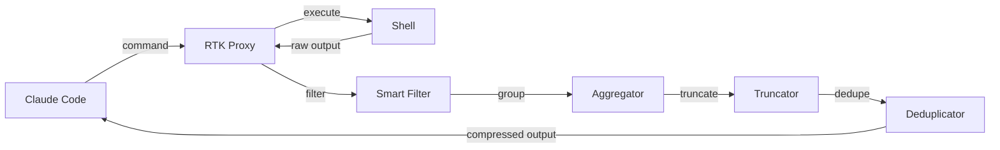
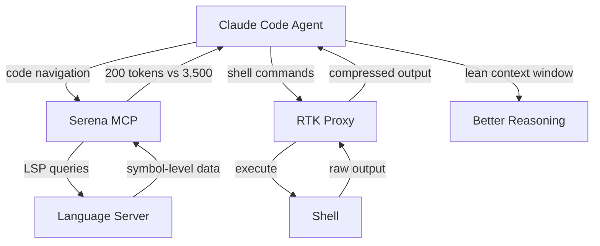

I ran `git log --oneline` in a Claude Code session. Fourteen lines of actual information. **4,200 tokens consumed.** Commit hashes, author emails, GPG signatures, merge metadata, decorations — all of it dumped into the context window because that's what `git log` returns.

The next command, `cat src/services/auth.service.ts`, ate another 3,500 tokens. Then `npm test` output: 6,000 tokens of pass/fail noise where only the 3 failures mattered.

**In 30 minutes, my session had burned through 150,000 tokens.** Not on reasoning. Not on code generation. On _reading command output_.

RTK fixes this. One Rust binary, zero dependencies, and suddenly the same session costs 45,000 tokens. **That's 70% less — for doing the exact same work.**

## The Hidden Tax: Why Command Output Is Killing Your Token Budget

Every time Claude Code runs a shell command, the full, unfiltered output goes straight into the context window. The model has to process all of it. And most of it is noise.

<TokenComparison
  title="A Typical 30-Minute Claude Code Session"
  approaches={[
    {
      name: 'Without RTK',
      color: 'red',
      steps: [
        { action: 'git log (full output)', tokens: 4200, time: '0.8s' },
        { action: 'cat auth.service.ts', tokens: 3500, time: '0.5s' },
        { action: 'npm test (all output)', tokens: 6000, time: '12s' },
        { action: 'ls -la (recursive)', tokens: 2800, time: '0.3s' },
        { action: 'grep across codebase', tokens: 8500, time: '2.1s' },
        { action: '~40 more commands...', tokens: 125000, time: '—' },
      ],
      totalTokens: 150000,
      totalCost: '$2.25',
      successRate: '—',
    },
    {
      name: 'With RTK',
      color: 'green',
      steps: [
        { action: 'rtk git log (compressed)', tokens: 840, time: '0.8s' },
        { action: 'rtk read auth.service.ts', tokens: 1050, time: '0.5s' },
        { action: 'rtk test npm test (failures only)', tokens: 600, time: '12s' },
        { action: 'rtk ls (grouped)', tokens: 560, time: '0.3s' },
        { action: 'rtk grep (deduplicated)', tokens: 1700, time: '2.1s' },
        { action: '~40 more commands...', tokens: 40250, time: '—' },
      ],
      totalTokens: 45000,
      totalCost: '$0.68',
      successRate: '—',
    },
  ]}
/>

**The math is simple:** when 70% of your token budget goes to reading shell output, compressing that output is the single highest-leverage optimization you can make.

And this isn't about changing how you work. RTK operates as a transparent proxy — Claude Code sends commands through it, the output gets compressed, and the model sees only what matters. Same workflow, fraction of the cost.

## What RTK Actually Does

RTK (Rust Token Killer) is a CLI proxy that sits between your AI agent and the shell. It intercepts command output and applies four compression strategies before the tokens hit the context window:

### 1. Smart Filtering

Strips noise that has zero informational value to the model: comments in config files, blank lines, boilerplate headers, decorative separators, and metadata the agent will never act on.

### 2. Grouping

Aggregates similar items. Instead of listing 47 `.tsx` files individually, RTK groups them: `components/ (47 .tsx files)`. The model knows there are 47 components without spending tokens on each filename.

### 3. Truncation

Preserves the head and tail of long outputs while cutting the redundant middle. Test output with 200 passing tests? You see the first few, a count, and the failures. That's all the model needs to decide what to fix.

### 4. Deduplication

Collapses repeated entries. Five identical warning lines become one line with `(×5)`. Log files with thousands of repeated entries shrink to a handful.

<Comparison
  title="git log Output"
  wrong="Full git log with commit hashes, author emails, GPG signatures, timestamps, merge metadata, branch decorations — 4,200 tokens for 14 commits."
  right="RTK strips metadata, keeps commit messages and short hashes — 840 tokens for the same 14 commits. The model knows exactly what changed."
  language="text"
/>

## Installation: 60 Seconds to 70% Savings

<Terminal
  title="Install RTK"
  lines={[
    {
      type: 'comment',
      content: '// Homebrew (recommended)',
    },
    {
      type: 'input',
      prompt: '$',
      content: 'brew install rtk',
    },
    {
      type: 'divider',
      content: '',
    },
    {
      type: 'comment',
      content: '// Or quick install script',
    },
    {
      type: 'input',
      prompt: '$',
      content:
        'curl -fsSL https://raw.githubusercontent.com/rtk-ai/rtk/refs/heads/master/install.sh | sh',
    },
    {
      type: 'divider',
      content: '',
    },
    {
      type: 'comment',
      content: '// Or from source via Cargo',
    },
    {
      type: 'input',
      prompt: '$',
      content: 'cargo install --git https://github.com/rtk-ai/rtk',
    },
    {
      type: 'success',
      content: '✓ RTK installed. Single binary, zero dependencies.',
    },
  ]}
/>

### Hook-First Setup (The Right Way)

RTK's hook-first architecture is the cleanest integration. A single `init` command installs a command hook that transparently rewrites operations — Claude Code doesn't even need to prefix commands with `rtk`.

<Terminal
  title="Initialize RTK for Claude Code"
  lines={[
    {
      type: 'input',
      prompt: '$',
      content: 'rtk init --global',
    },
    {
      type: 'output',
      content: 'Creating RTK.md (~10 lines, ~10 tokens)...',
    },
    {
      type: 'output',
      content: 'Installing command hook...',
    },
    {
      type: 'success',
      content: '✓ Hook installed. Add to ~/.claude/settings.json to activate.',
    },
    {
      type: 'divider',
      content: '',
    },
    {
      type: 'comment',
      content: '// Verify it works',
    },
    {
      type: 'input',
      prompt: '$',
      content: 'rtk gain',
    },
    {
      type: 'success',
      content: '✓ RTK active. No sessions tracked yet.',
    },
  ]}
/>

After `init`, add the hook to your Claude Code settings. From there, every command flows through RTK automatically. No workflow changes, no command prefixes, no friction.

## The Token Savings Breakdown

Not all commands are created equal. Some operations compress dramatically, others less so. Here's what I've measured across real sessions:

| Operation                         | Raw Tokens | RTK Tokens | Savings |
| --------------------------------- | ---------- | ---------- | ------- |
| `ls` / `tree` (directory listing) | ~2,800     | ~560       | **80%** |
| `cat` / file reads                | ~3,500     | ~1,050     | **70%** |
| `grep` / `rg` (search)            | ~8,500     | ~1,700     | **80%** |
| `git status`                      | ~1,200     | ~300       | **75%** |
| `git log`                         | ~4,200     | ~840       | **80%** |
| `git diff`                        | ~12,000    | ~960       | **92%** |
| `npm test` / `pytest`             | ~6,000     | ~600       | **90%** |

<Icon name="TrendingDown" size={16} className="text-primary" /> The biggest wins come from **test
output** and **git diffs** — exactly the operations that eat the most context in a typical coding
session.

### Tracking Your Savings

RTK has built-in analytics. After a few sessions, run:

<Terminal
  title="RTK Token Savings Analytics"
  lines={[
    {
      type: 'input',
      prompt: '$',
      content: 'rtk gain',
    },
    {
      type: 'output',
      content: 'Session: 2026-03-01',
    },
    {
      type: 'output',
      content: 'Commands processed: 67',
    },
    {
      type: 'output',
      content: 'Raw tokens: 148,320',
    },
    {
      type: 'output',
      content: 'Compressed tokens: 43,116',
    },
    {
      type: 'success',
      content: '✓ Saved: 105,204 tokens (70.9%)',
    },
    {
      type: 'divider',
      content: '',
    },
    {
      type: 'input',
      prompt: '$',
      content: 'rtk gain --graph',
    },
    {
      type: 'output',
      content: '30-day token savings trend (ASCII graph)',
    },
    {
      type: 'divider',
      content: '',
    },
    {
      type: 'input',
      prompt: '$',
      content: 'rtk discover',
    },
    {
      type: 'output',
      content: 'Commands RTK handles but you are not using:',
    },
    {
      type: 'output',
      content: '  docker logs → rtk docker logs (est. 85% savings)',
    },
    {
      type: 'output',
      content: '  kubectl get pods → rtk kubectl pods (est. 78% savings)',
    },
    {
      type: 'success',
      content: '✓ Potential additional savings: ~12,000 tokens/session',
    },
  ]}
/>

<Icon name="Lightbulb" size={16} className="text-primary" /> The `rtk discover` command analyzes
your Claude Code session history and identifies commands you're running raw that RTK could compress.
It even estimates the savings. This is how I found I was wasting 12,000 extra tokens per session on
`docker logs` alone.

## Why I'm Using RTK Right Now

I hit the wall. Not the technical wall — the **quota wall**.

When you use Claude Code daily for production work, token consumption adds up fast. I was running into quota limits mid-afternoon, right when I needed to push features. The frustrating part? Most of those tokens weren't going to code generation or reasoning. They were going to reading `git diff` output and test logs.

RTK gave me my afternoons back. **Same sessions, same output quality, 70% less token consumption.** I'm now consistently finishing full workdays within quota, and the sessions feel identical — because RTK is invisible. It's a hook. I don't prefix commands, I don't change my workflow, I don't think about it.

The second reason is **context window quality**. When the context window is bloated with raw command output, the model's attention is diluted. It has to process thousands of irrelevant tokens to find the signal. With RTK compressing outputs, the context stays lean — more room for actual code, actual reasoning, and actual conversation. The model performs noticeably better when it's not swimming through noise.

## The Power Combo: RTK + Serena MCP

Here's where it gets interesting. RTK and Serena MCP attack the token efficiency problem from **completely different angles**, and together they create something greater than the sum of their parts.

<Comparison
  title="Two Sides of Token Efficiency"
  wrong="Using only one optimization layer: either you compress command output (RTK) or you navigate code surgically (Serena), but the other side still hemorrhages tokens."
  right="Stack both layers: Serena eliminates unnecessary file reads at the code navigation level. RTK compresses everything that still needs to go through the shell. Two-pronged attack on token waste."
  language="text"
/>

### What Serena Solves

Serena MCP gives your AI agent **LSP-powered code navigation** — the same "Go to Definition," "Find All References," and symbol-level editing that your IDE uses. Instead of `cat`-ing an entire 500-line file to find one function, the agent calls `get_symbols_overview` (200 tokens) and then reads only the target symbol body (50 tokens).

**Serena eliminates unnecessary file reads at the source.** The agent never asks to read a full file when a symbol lookup will do.

### What RTK Solves

RTK compresses **everything that still goes through the shell** — test output, git operations, directory listings, search results, build logs. Even with Serena handling code navigation, there are dozens of shell commands per session that produce bloated output.

**RTK compresses the output of commands the agent must still run.**

### The Combined Architecture

### Real-World Numbers: The Stack in Action

Here's a real refactoring session I ran last week — renaming a service method across 12 files:

<TokenComparison
  title="Refactoring Session: Method Rename Across 12 Files"
  approaches={[
    {
      name: 'Vanilla Claude Code',
      color: 'red',
      steps: [
        { action: 'cat 12 files to find method', tokens: 42000, time: '18s' },
        { action: 'grep for all references', tokens: 8500, time: '2.1s' },
        { action: 'git diff after changes', tokens: 14000, time: '1.2s' },
        { action: 'npm test (full output)', tokens: 6000, time: '15s' },
        { action: 'git log to check history', tokens: 4200, time: '0.8s' },
      ],
      totalTokens: 74700,
      totalCost: '$1.12',
      successRate: '—',
    },
    {
      name: 'RTK + Serena MCP',
      color: 'green',
      steps: [
        { action: 'Serena: find_symbol + get_references', tokens: 800, time: '1.2s' },
        { action: 'Serena: replace_symbol_body × 12', tokens: 3600, time: '4.8s' },
        { action: 'RTK: compressed git diff', tokens: 1120, time: '1.2s' },
        { action: 'RTK: test output (failures only)', tokens: 600, time: '15s' },
        { action: 'RTK: compressed git log', tokens: 840, time: '0.8s' },
      ],
      totalTokens: 6960,
      totalCost: '$0.10',
      successRate: '—',
    },
  ]}
/>

**74,700 tokens vs 6,960 tokens.** That's a **90.7% reduction** for the exact same refactoring task. Same result, same code quality, ten times less cost.

The breakdown shows why neither tool alone is enough:

- <Icon name="Target" size={16} className="text-primary" /> **Serena** eliminated the 42,000 tokens
  of unnecessary file reads — by far the biggest single savings
- <Icon name="Zap" size={16} className="text-primary" /> **RTK** compressed the remaining shell
  output from 32,700 tokens to 2,560 — a 92% compression on the operations that still needed the
  shell
- <Icon name="Brain" size={16} className="text-primary" /> **Together**, they brought the total from
  74,700 to 6,960 — a savings that neither could achieve alone

### Why They Don't Overlap

This is the key insight: **RTK and Serena operate on completely different token sources.** There's no redundancy.

Serena intercepts at the **code navigation layer** — replacing `cat`, `grep-for-code`, and full-file reads with LSP symbol queries. RTK intercepts at the **shell output layer** — compressing `git`, `test`, `ls`, `docker`, and every other command that produces text.

<FileTree
  items={[
    {
      id: '1',
      name: 'Token Sources in a Session',
      type: 'folder',
      children: [
        {
          id: '2',
          name: 'Code Navigation (Serena handles)',
          type: 'folder',
          children: [
            { id: '3', name: 'file reads → symbol queries', type: 'file' },
            { id: '4', name: 'grep for code → find_symbol', type: 'file' },
            { id: '5', name: 'full-file edits → replace_symbol_body', type: 'file' },
          ],
        },
        {
          id: '6',
          name: 'Shell Commands (RTK handles)',
          type: 'folder',
          children: [
            { id: '7', name: 'git status/log/diff → compressed', type: 'file' },
            { id: '8', name: 'test output → failures only', type: 'file' },
            { id: '9', name: 'ls/tree → grouped', type: 'file' },
            { id: '10', name: 'docker/kubectl → filtered', type: 'file' },
            { id: '11', name: 'build logs → truncated', type: 'file' },
          ],
        },
      ],
    },
  ]}
/>

They cover different surfaces. Stack them and you've sealed nearly every source of token waste in a coding session.

## Setting Up the Full Stack

If you already have Serena MCP configured (and if you've read my [previous post on Serena](/blog/serena-mcp-architectural-mastery), you probably do), adding RTK takes 60 seconds:

<Terminal
  title="Adding RTK to an Existing Serena + Claude Code Setup"
  lines={[
    {
      type: 'comment',
      content: '// Step 1: Install RTK',
    },
    {
      type: 'input',
      prompt: '$',
      content: 'brew install rtk',
    },
    {
      type: 'success',
      content: '✓ RTK installed',
    },
    {
      type: 'divider',
      content: '',
    },
    {
      type: 'comment',
      content: '// Step 2: Initialize with global hook',
    },
    {
      type: 'input',
      prompt: '$',
      content: 'rtk init --global',
    },
    {
      type: 'success',
      content: '✓ Hook installed. RTK.md created.',
    },
    {
      type: 'divider',
      content: '',
    },
    {
      type: 'comment',
      content: '// Step 3: Add hook to Claude Code settings',
    },
    {
      type: 'output',
      content: 'Add the RTK hook to ~/.claude/settings.json',
    },
    {
      type: 'success',
      content: '✓ Done. Serena handles code, RTK handles shell output.',
    },
    {
      type: 'divider',
      content: '',
    },
    {
      type: 'comment',
      content: '// Verify both are active',
    },
    {
      type: 'input',
      prompt: '$',
      content: 'rtk gain && claude mcp list',
    },
    {
      type: 'success',
      content: '✓ RTK: active | Serena MCP: connected',
    },
  ]}
/>

That's it. Two tools, zero conflicts, complementary coverage. Every Claude Code session from this point forward runs at a fraction of the token cost.

## Why You Should Be Using RTK

Let me be direct: if you use Claude Code (or any LLM-powered coding agent) and you're **not** compressing command output, you're wasting money and hitting quota limits unnecessarily.

Here's the case:

- <Icon name="Zap" size={16} className="text-primary" /> **Zero workflow change.** RTK is a hook.
  It's invisible after setup. You don't change how you work.
- <Icon name="TrendingDown" size={16} className="text-primary" /> **70% average token savings.**
  Measured across real sessions, not synthetic benchmarks.
- <Icon name="Clock" size={16} className="text-primary" /> **Longer sessions within quota.** The
  same token budget covers 3x more work.
- <Icon name="Brain" size={16} className="text-primary" /> **Better model performance.** Less noise
  in the context window means the model focuses on what matters.
- <Icon name="Rocket" size={16} className="text-primary" /> **Single Rust binary.** No dependencies,
  no runtime, no configuration files to maintain. It just works.

The cost of not using RTK is measured in tokens you burn every single session on output nobody — not you, not the model — actually needs to see.

<Comparison
  title="The Decision"
  wrong="Continue burning 150,000 tokens per session on uncompressed shell output. Hit quota limits. Pay more. Get worse model attention because the context window is full of git metadata and test boilerplate."
  right="Install one binary. Run one init command. Save 70% on every session going forward. Pair with Serena MCP for 90%+ total savings. Never think about it again."
  language="text"
/>

## What's Next

RTK is evolving fast. The `rtk discover` command already identifies optimization opportunities you're missing. The analytics (`rtk gain --graph`) let you track savings over time. And the command coverage keeps expanding — Docker, Kubernetes, GitHub CLI, linters, formatters, package managers.

The broader picture is this: **token efficiency is the infrastructure layer of AI-assisted development.** As models get more capable, we'll use them for longer, more complex sessions. The agents that win will be the ones with lean context windows — where every token carries signal, not noise.

RTK and Serena MCP are two pieces of that infrastructure. RTK compresses the shell. Serena compresses code navigation. Together, they've turned my Claude Code sessions from token-expensive sprints into all-day marathons.

**Install RTK. Pair it with Serena. Your quota will thank you.**

## Resources

- **[RTK (Rust Token Killer)](https://github.com/rtk-ai/rtk)** — CLI proxy for LLM token compression
- **[Serena MCP](https://github.com/oraios/serena)** — LSP-based AI code navigation
- **[Surgical Code Editing](/blog/surgical-code-editing)** — Token efficiency patterns with symbolic operations
- **[Serena MCP Deep Dive](/blog/serena-mcp-architectural-mastery)** — Full guide to LSP-powered AI agents
- **[Claude Code](https://claude.ai/download)** — Anthropic's terminal-based coding agent
