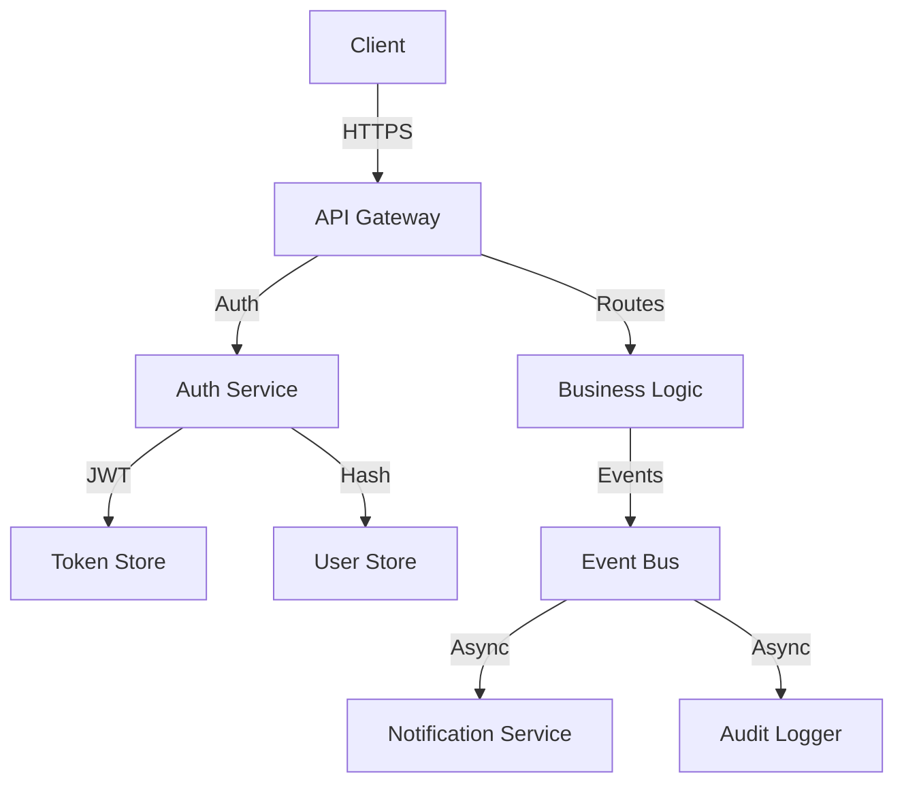
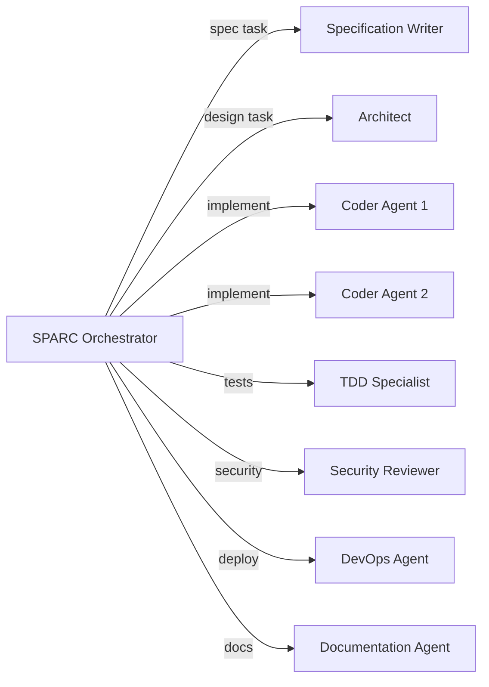

Last month I watched an engineer spend 3 hours asking Claude to "build a user authentication system." The model generated code. The engineer said "that's not right." The model regenerated. Back and forth, 47 messages deep, and the result was a spaghetti mess of half-working auth logic with no tests, no error handling, and security vulnerabilities the engineer hadn't thought to mention.

**That's vibe coding.** And it's how most people work with AI today.

The problem isn't the model. The problem is the process — or rather, the complete absence of one. When you treat an AI coding assistant like a slot machine ("generate code, regenerate, regenerate until it looks right"), you get slot machine results: unpredictable, inconsistent, and impossible to maintain.

SPARC changes this. It's a structured methodology that turns AI from a code slot machine into a disciplined engineering partner.

## What Is SPARC?

SPARC stands for **Specification, Pseudocode, Architecture, Refinement, and Completion** — five sequential phases that guide AI-assisted development from requirements to production-ready code.

<ProcessFlow
  title="The Five Phases of SPARC"
  steps={[
    {
      title: 'Specification',
      description:
        'Define clear, testable requirements. Capture functional and non-functional needs, acceptance criteria, edge cases, security requirements, and success metrics before writing a single line of code.',
    },
    {
      title: 'Pseudocode',
      description:
        'Design algorithms and logic flow at a conceptual level. Plan implementation strategies, identify data structures, map out key functions, and validate feasibility — all before real code exists.',
    },
    {
      title: 'Architecture',
      description:
        'Define system components, interfaces, data flow, and technology decisions. Establish patterns for communication, error handling, and scalability. Create the structural blueprint.',
    },
    {
      title: 'Refinement',
      description:
        'Iteratively improve through Test-Driven Development. Red-Green-Refactor cycles until >80% test coverage. Keep modules under 500 lines. Eliminate hard-coded values. Optimize and harden.',
    },
    {
      title: 'Completion',
      description:
        'Finalize for production. Integration testing, performance optimization, security hardening, comprehensive documentation, deployment preparation, and readiness verification.',
    },
  ]}
/>

<Callout author="Reuven Cohen (rUv)" role="Creator of SPARC, Agentics Foundation" type="quote">
  SPARC is the Agile methodology for AI agents — while vibe coding is a jazz solo, SPARC is a
  symphony where each AI agent plays its part on cue in harmony toward a repeatable delivery
  pipeline.
</Callout>

The key insight: **each phase has defined inputs, outputs, and deliverables.** The AI doesn't get an open-ended "build me something" prompt. It gets a scoped, structured task with clear success criteria at every step.

## Why Vibe Coding Fails

Let's be honest about what happens when you skip structure:

<Comparison
  title="Vibe Coding vs. Structured Development"
  wrong="Prompt → Code → 'That's not right' → Regenerate → 'Closer but...' → Regenerate → Regenerate → Give up and manually fix → Ship untested code with unknown edge cases. No documentation. No tests. No architecture. Just vibes."
  right="Specify requirements → Design algorithms → Plan architecture → Write tests first → Implement to pass tests → Refactor → Verify → Document → Deploy. Every phase has clear inputs, outputs, and validation. The AI works within guardrails, not in the dark."
/>

The failure modes of unstructured AI development are well-documented:

- **Unpredictable outcomes** — Same prompt, different results every time
- **Missing requirements discovered late** — "Oh, we also need authentication" at step 47
- **No testing strategy** — Tests are an afterthought, if they exist at all
- **Architecture by accident** — The system structure emerges from whatever the model generates first
- **Impossible to parallelize** — One person, one chat, one linear thread
- **Impossible to maintain** — No one, including the model, understands why the code looks the way it does

SPARC addresses every single one of these by front-loading the thinking.

## Phase by Phase: How It Actually Works

### Phase 1: Specification — Think Before You Build

This is where most people fail. They jump straight to "write me a REST API" without specifying what the API does, how it handles errors, what the authentication model is, or what constitutes success.

In SPARC, specification is a deliverable. The output is a `specification.md` that captures:

- Functional requirements with acceptance criteria
- Non-functional requirements (performance, security, scalability)
- Edge cases and failure modes
- User stories and scenarios
- API contracts
- Success metrics

**Why it matters for AI:** Models hallucinate when requirements are ambiguous. A clear specification removes ambiguity. The model doesn't guess what you want — it implements what you specified.

### Phase 2: Pseudocode — Design the Algorithm First

Before writing real code, you map the logic at a conceptual level. This catches design flaws before any implementation effort is invested.

```text
// Example: User Authentication Flow (pseudocode.md)

FUNCTION authenticateUser(credentials):
  VALIDATE email format AND password strength
  HASH password with bcrypt (12 rounds)
  QUERY user store by email
  IF user not found → RETURN AuthError.NOT_FOUND
  IF password hash mismatch → INCREMENT failed attempts
    IF failed attempts >= 5 → LOCK account for 30 minutes
    RETURN AuthError.INVALID_CREDENTIALS
  RESET failed attempts
  GENERATE JWT with 15-minute expiry
  GENERATE refresh token with 7-day expiry
  STORE refresh token (hashed) in token store
  RETURN { accessToken, refreshToken, expiresIn }
```

This pseudocode surfaces decisions the engineer might not have considered: rate limiting, account locking, refresh token rotation, hash algorithm selection. All before a single line of real code exists.

### Phase 3: Architecture — Blueprint the System

With requirements and algorithms defined, the architecture phase designs the structural blueprint:



The architecture document specifies:

- System services and their responsibilities
- Communication patterns (sync vs. async)
- Data models and relationships
- Technology stack decisions with rationale
- Cross-cutting concerns (logging, monitoring, error handling)
- Integration points and failure strategies

### Phase 4: Refinement — Test-Driven Iteration

This is where SPARC diverges most sharply from vibe coding. Instead of "generate code and hope it works," Refinement uses **Red-Green-Refactor TDD cycles**:

<ProcessFlow
  title="Red-Green-Refactor Cycle"
  steps={[
    {
      title: 'Red — Write a Failing Test',
      description:
        'Write a test that describes the desired behavior. Run it. Watch it fail. This test is your contract — the code must satisfy it.',
    },
    {
      title: 'Green — Minimal Implementation',
      description:
        'Write the minimum code needed to pass the test. Nothing more. No optimizations, no abstractions, no "while I am here" improvements.',
    },
    {
      title: 'Refactor — Improve Quality',
      description:
        'With the safety net of passing tests, improve code readability, eliminate duplication, and optimize performance. Run tests again. Green means you are done.',
    },
  ]}
/>

The targets are concrete: **>80% test coverage, modules under 500 lines, zero hard-coded environment variables.** The AI iterates until these thresholds are met — not until someone says "looks good enough."

### Phase 5: Completion — Production Ready

The final phase ensures the system is genuinely ready for production:

- Integration testing across all components
- Performance optimization under realistic load
- Security hardening (OWASP top 10, dependency audit)
- Comprehensive documentation generation
- Deployment procedures and rollback plans
- Monitoring and alerting configuration

## The Multi-Agent Advantage

SPARC wasn't designed for one person chatting with one model. It was designed for **multi-agent orchestration** — specialized AI agents handling different phases in parallel.



SPARC provides **17 specialized modes**, each with a focused responsibility. The SPARC Orchestrator breaks down the objective and delegates to specialized agents. Multiple coders implement in parallel while the TDD specialist ensures test coverage, the security reviewer audits, and the documentation agent generates final docs.

The result: **4.4x speed improvement** over sequential development. But this only works because SPARC's structure provides clear handoffs between phases. Without defined inputs and outputs, parallel agents step on each other. With SPARC, they compose.

## SPARC vs. Raw Iteration: The Data

| Aspect           | Vibe Coding                                            | SPARC                                                      |
| ---------------- | ------------------------------------------------------ | ---------------------------------------------------------- |
| Planning         | Minimal upfront                                        | Comprehensive (Spec + Pseudocode + Architecture)           |
| Testing          | Reactive — add tests after                             | Test-First — TDD in Refinement phase                       |
| Quality control  | Hope for the best                                      | Built into every phase                                     |
| Parallelization  | One thread, one chat                                   | 4.4x faster with multi-agent                               |
| Maintainability  | Often poor — nobody knows why the code looks like this | Excellent — spec, architecture, and tests document intent  |
| Security         | Afterthought                                           | By design — reviewed in Refinement, hardened in Completion |
| Scalability      | "We'll deal with it later"                             | Architected from Phase 3                                   |
| AI effectiveness | Variable — depends on prompt quality                   | Optimized — structured inputs reduce hallucination         |

The most important row is **AI effectiveness.** When you give a model clear specifications, tested algorithms, and architectural constraints, it produces dramatically better code. Advanced prompt engineering through specialized agent teams achieves fundamentally better results than "write me a thing."

## Getting Started with SPARC

You don't need a multi-agent system to start. SPARC works with a single AI assistant — the methodology is what matters, not the tooling.

<Terminal
  title="SPARC Project Setup"
  lines={[
    {
      type: 'comment',
      content: '// Option 1: Use create-sparc for full scaffolding',
    },
    {
      type: 'input',
      prompt: '$',
      content: 'npx create-sparc init my-project',
    },
    {
      type: 'success',
      content: '✓ Project initialized with SPARC structure',
    },
    {
      type: 'divider',
      content: '',
    },
    {
      type: 'comment',
      content: '// Option 2: Manual structure (minimal)',
    },
    {
      type: 'input',
      prompt: '$',
      content:
        'mkdir -p docs && touch docs/specification.md docs/pseudocode.md docs/architecture.md',
    },
    {
      type: 'success',
      content: '✓ Phase documents created. Start with specification.md.',
    },
  ]}
/>

### The Practical Workflow

Here's how I use SPARC in daily Claude Code sessions:

**1. Start every feature with a spec.** Before asking Claude to write code, I write (or ask Claude to draft) a `specification.md` with requirements, acceptance criteria, and edge cases. This becomes the reference document for the entire feature.

**2. Draft pseudocode before implementation.** I ask Claude to design the algorithm in pseudocode first. This surfaces design decisions and catches logical errors before any code exists. Review the pseudocode, iterate, then proceed.

**3. Architecture for anything non-trivial.** If the feature touches multiple files or services, I ask Claude to produce an architecture document first. Component diagram, data flow, integration points. Then implement against the blueprint.

**4. Write tests first in Refinement.** I ask Claude to write failing tests for each requirement from the spec. Then implement to pass the tests. Then refactor. The tests become a living verification of the spec.

**5. Completion checklist.** Before merging, I run through: integration tests pass, no security vulnerabilities introduced, documentation updated, deployment plan exists.

<Callout type="tip">
  You don't have to run all five phases for every change. A bug fix might only need Specification
  (what's broken, what "fixed" looks like) and Refinement (test that reproduces the bug, then fix).
  SPARC scales to the size of the task.
</Callout>

## Why SPARC Matters Now

As AI coding capabilities improve, the gap between structured and unstructured approaches will widen. Better models don't fix bad processes — they amplify them. A more powerful model with no specification still hallucinates. A more powerful model with no tests still ships bugs. A more powerful model with no architecture still creates spaghetti.

SPARC provides the guardrails that make AI autonomy safe:

- <Icon name="Shield" size={16} className="text-primary" /> **Prevents hallucination** — Clear
  specifications eliminate ambiguity
- <Icon name="GitBranch" size={16} className="text-primary" /> **Enables parallelization** — Defined
  phases with clear handoffs
- <Icon name="TestTube" size={16} className="text-primary" /> **Guarantees quality** — TDD creates a
  safety net at every step
- <Icon name="FileText" size={16} className="text-primary" /> **Creates documentation** — Each phase
  produces a document, not just code
- <Icon name="Repeat" size={16} className="text-primary" /> **Makes work repeatable** — Same
  methodology, consistent results, across teams and agents

The engineers who adopt structured AI workflows now will have a compounding advantage. Every project builds institutional knowledge. Every spec becomes a template. Every architecture decision becomes a reference. The gap between disciplined AI development and vibe coding will only grow.

**Stop vibing. Start engineering.**

## Resources

- **[SPARC Methodology (GitHub)](https://github.com/ruvnet/sparc)** — Original framework by Reuven Cohen
- **[create-sparc (npm)](https://www.npmjs.com/package/create-sparc)** — CLI scaffolding tool
- **[Roo Code](https://roocode.com/)** — AI coding assistant with SPARC integration
- **[Agentics Foundation](https://agentics.org/)** — Community driving agentic engineering standards
- **[SPARC Revolution (Obvious Works)](https://www.obviousworks.ch/en/sparc-revolution-when-ai-agents-take-over-development/)** — Deep analysis of SPARC adoption
- **[Agentic AI Needs Guardrails (Bencium)](https://bencium.substack.com/p/agentic-ai-needs-guardrails-introducing)** — Why structure matters for AI agents
