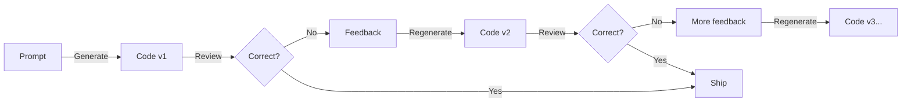
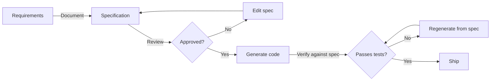

Here's a pattern I see every week: a developer asks an AI agent to "add a payment endpoint." The agent generates 200 lines of code. The developer reviews it and says "no, it needs Stripe webhook verification." The agent regenerates. "Also, it needs idempotency keys." Regenerates again. "And rate limiting." Again. Four rounds later, the code is a Frankenstein of patched-together generations, and nobody — not the developer, not the agent — has a clear picture of what the endpoint is supposed to do.

The agent rushed to code because that's what it was asked to do. No one stopped to define what "add a payment endpoint" actually means.

**Spec-driven development (SDD) fixes this by making specifications — not code — the source of truth.** Define what you want. Validate it. Then let the agent implement against a documented contract.

## The Specification Gap

Code alone lacks critical information. When an AI agent receives "add a payment endpoint," it has to infer:

- Authentication model (API key? OAuth? JWT?)
- Error handling strategy (what happens when Stripe is down?)
- Data validation (what constitutes a valid payment request?)
- Edge cases (duplicate payments? currency conversion? partial refunds?)
- Integration points (webhooks? event queues? audit logs?)
- Performance requirements (latency budget? throughput?)

Without structure, the agent makes assumptions. Some will be wrong. You'll discover which ones during review — or worse, in production.

<Comparison
  title="The Specification Gap"
  wrong="'Add a payment endpoint' → Agent assumes REST, no auth, basic validation, no webhooks, no idempotency. Four rounds of regeneration. The final code is a patchwork of corrections with no coherent design. No tests. No documentation."
  right="Payment endpoint specification defines: Stripe integration with webhook verification, JWT auth, idempotency via request keys, retry logic with exponential backoff, event emission for audit trail. Agent implements against this contract. One round. Tests validate the spec."
/>

## What Is Spec-Driven Development?

SDD is a structured workflow where detailed specifications are written before code is generated. Specifications serve as the authoritative source of truth for both human developers and AI agents.

Tessl, the company pioneering this approach, defines three adoption levels:

<ProcessFlow
  title="Spec-Driven Development Maturity Levels"
  steps={[
    {
      title: 'Spec-First',
      description:
        'Specifications written for immediate tasks. They guide implementation but may be discarded after. The lightest adoption level — good for getting started.',
    },
    {
      title: 'Spec-Anchored',
      description:
        'Specifications persist and evolve with features throughout their lifetime. They serve as living documentation and regression guards. Code and specs stay in sync.',
    },
    {
      title: 'Spec-as-Source',
      description:
        'Specifications become the canonical artifact. Code is entirely generated and regenerable from specs. The specification IS the product — code is a derived artifact.',
    },
  ]}
/>

The most ambitious level — spec-as-source — inverts traditional development entirely. The specification isn't documentation of code. The code is a derivation of the specification. If you change the spec, you regenerate the code. If the code doesn't match the spec, the code is wrong.

## How Tessl Implements SDD

Tessl provides two complementary products:

### The Tessl Framework (Closed Beta)

The framework guides AI agents through structured development workflows before any coding begins. It requires three resources:

1. **Written plans** outlining change strategies
2. **Natural language specifications** capturing intended functionality
3. **Tests** validating code against intent

Specifications map 1:1 to code files. Generated code is marked with `// GENERATED FROM SPEC - DO NOT EDIT` comments. The framework supports annotations:

```text
@generate    → Produce code from this specification
@describe    → Document existing code as a specification
@use         → Import another specification as a dependency
```

This creates a traceable chain: specification → generated code → tests → verification. At every point, you can answer "why does this code exist?" by tracing back to the spec.

### The Tessl Spec Registry (Open Beta)

This is where it gets interesting. Tessl maintains a registry of **over 10,000 version-matched specifications** for open-source libraries. These specs tell AI agents exactly how to use a library's API — the correct function signatures, parameters, return types, and patterns for a specific version.

<Callout type="info">
  The spec registry directly attacks the hallucination problem. Without it, AI agents generate
  outdated API calls, confuse library versions, and invent functions that don't exist. With
  version-matched specs, the agent works from verified documentation — not training data that may be
  months or years old.
</Callout>

The results are measurable:

| Case Study           | Without Specs          | With Specs            | Improvement          |
| -------------------- | ---------------------- | --------------------- | -------------------- |
| ElevenLabs API usage | Baseline agent success | 2x agent success rate | **100% improvement** |
| Bowser npm library   | 57% accuracy           | 93% accuracy          | **63% improvement**  |

Teams can also publish custom specifications to the registry — reflecting internal standards, security policies, and architectural preferences. Your organization's "how we do authentication" becomes a spec that every AI agent in the company follows.

## The Four-Step Tessl Workflow

<ProcessFlow
  title="Spec-Driven Development with Tessl"
  steps={[
    {
      title: 'Requirements Gathering',
      description:
        'Agent asks clarifying questions about endpoints, authentication, error handling, data management, and edge cases. Nothing is assumed — everything is documented.',
    },
    {
      title: 'Specification Creation',
      description:
        'Documentation in specs/ folders captures functional requirements, API contracts, edge cases, and test links. Each spec describes a component with capabilities, API definition, and verification criteria.',
    },
    {
      title: 'Approval Checkpoint',
      description:
        'Users and stakeholders review specifications before development begins. This is the critical gate — catching misalignment here prevents costly mid-project corrections.',
    },
    {
      title: 'Specification-Aligned Implementation',
      description:
        'Agents build against documented requirements and verify compliance upon completion. Code is generated from specs, not from ambiguous prompts.',
    },
  ]}
/>

The approval checkpoint is the most important step. In traditional AI-assisted development, the first time a human reviews the agent's interpretation of requirements is when they review the generated code. By then, wrong assumptions are baked into the implementation. With SDD, you review the spec — and fixing a spec is orders of magnitude cheaper than fixing code.

## Why This Matters: The Cost of Iteration

<Callout type="tip">
  Spec-driven iteration is genuinely low-cost: rewind, improve the spec, ask the agent to
  regenerate. No need to start from scratch when the output isn't correct. The spec preserves your
  intent across regeneration cycles.
</Callout>

This is the fundamental economics of SDD. Traditional AI development has a hidden cost curve:



Each regeneration cycle costs tokens, time, and attention. And because the agent has no persistent memory of requirements, each cycle risks introducing new misalignments while fixing old ones.

With SDD:



The spec acts as a stable anchor. Regeneration happens against a documented contract, not a drifting conversation. The agent can regenerate code confidently because the specification hasn't changed.

## The Competitive Landscape (2026)

SDD isn't just Tessl. Three major platforms launched dedicated tooling in rapid succession:

| Tool                | Approach                                                                  | Best For                                                           |
| ------------------- | ------------------------------------------------------------------------- | ------------------------------------------------------------------ |
| **Tessl Framework** | Spec-anchored / spec-as-source, 1:1 spec-to-code mapping, paired registry | Production teams wanting the deepest spec integration              |
| **GitHub Spec Kit** | Spec-first workflow with Constitution → Specify → Plan → Tasks            | Teams using Copilot/Claude/Gemini who want open-source flexibility |
| **AWS Kiro**        | Requirements → Design → Tasks with VS Code integration                    | Simplest entry point, lightweight steering approach                |

Tessl's competitive advantage is the registry. Having 10,000+ pre-built, version-matched specs means agents start with verified API knowledge instead of training data. That's a moat that compounds — every new library spec makes the platform more valuable.

## The Honest Tradeoffs

SDD isn't a silver bullet. The honest assessment:

### Where It Shines

- **Greenfield features** with well-understood requirements — new API endpoints, CRUD modules, integration layers
- **Teams with governance needs** — auditable specs create compliance trails
- **Complex domains** where getting requirements wrong is expensive — payments, authentication, data pipelines
- **Long-lived products** where specs serve as living documentation

### Where It Struggles

- **Simple changes** — A typo fix doesn't need a specification lifecycle
- **Exploratory work** — Prototyping and UI experiments need speed, not specs
- **Rapidly changing requirements** — Specs can become stale faster than they're updated
- **Overhead concern** — If spec review takes longer than code review, the process is counterproductive

<Comparison
  title="When To Use SDD"
  wrong="Writing a 16-point specification with acceptance criteria for a CSS color change. Using full SDD lifecycle for a one-line bug fix. Creating specs for throwaway prototypes. Treating every change as production-critical."
  right="Using SDD for new features, API endpoints, and architectural decisions where getting requirements wrong costs real time and money. Scaling the process to the size of the change. Skipping specs for trivial fixes and exploratory work."
/>

The key is matching process to problem size. Not every change deserves a specification. But every significant feature deserves one.

## Specs as Long-Term Memory

Here's the underappreciated benefit of SDD: specifications function as **long-term memory of what your product should do.**

Code tells you _how_ something works. Specifications tell you _why_ it exists and _what_ it should do. When a new developer joins the team (or a new AI agent session starts), the spec provides context that code alone cannot.

This matters especially for AI agents, which have no memory between sessions. A specification document gives the agent instant context about the component it's working on — its purpose, constraints, API contract, and test criteria. No ramp-up time. No re-discovery.

<Callout type="info">
  Think of specs as the institutional knowledge layer. Engineers leave. Conversations get lost. Code
  gets refactored beyond recognition. Specifications persist, evolve, and maintain the original
  intent across all of these changes.
</Callout>

## Getting Started

The lightest way to adopt SDD is spec-first for your next feature:

<Terminal
  title="Starting with Spec-Driven Development"
  lines={[
    {
      type: 'comment',
      content: '// Install Tessl specs for your stack',
    },
    {
      type: 'input',
      prompt: '$',
      content: 'tessl install tessl-labs/spec-driven-development',
    },
    {
      type: 'divider',
      content: '',
    },
    {
      type: 'comment',
      content: '// Or start manually — create a spec before coding',
    },
    {
      type: 'input',
      prompt: '$',
      content: 'mkdir -p specs && touch specs/payment-endpoint.md',
    },
    {
      type: 'divider',
      content: '',
    },
    {
      type: 'comment',
      content: '// Include in your AI prompt',
    },
    {
      type: 'input',
      prompt: '$',
      content: 'echo "Read specs/payment-endpoint.md and implement against this specification"',
    },
    {
      type: 'success',
      content: '✓ The agent now has a contract to implement against, not a vague prompt.',
    },
  ]}
/>

Even without Tessl's tooling, the practice of writing a specification document before asking an AI agent to generate code will immediately improve your results. The spec becomes the prompt — structured, complete, and reviewable.

## The Paradigm Shift

We're at an inflection point. The first wave of AI-assisted development was "let the model write code." The second wave is "let the model implement specifications." The difference is enormous:

- <Icon name="FileCheck" size={16} className="text-primary" /> **Declared intent** transforms into
  validated code, not guessed intent into hoped-for code
- <Icon name="Shield" size={16} className="text-primary" /> **Requirement changes** become spec
  edits and regeneration, not manual rework
- <Icon name="Eye" size={16} className="text-primary" /> **Review shifts** from "does this code do
  what I want?" to "does this spec capture what I want?"
- <Icon name="Database" size={16} className="text-primary" /> **Institutional knowledge** lives in
  specs, not in people's heads or lost chat histories
- <Icon name="RefreshCw" size={16} className="text-primary" /> **Regeneration** becomes safe because
  the contract is stable

The teams adopting SDD now are building specification libraries that compound over time. Every new spec is a template. Every refined spec is institutional knowledge. Every verified spec is a regression guard.

Over 450 tools now support spec-driven workflows. Three major platforms have launched dedicated SDD tooling in 2026 alone. The ecosystem is forming fast.

**Write the spec. Then write the code.**

## Resources

- **[Tessl](https://tessl.io/)** — AI-native development platform pioneering SDD
- **[Tessl Docs: Spec-Driven Development](https://docs.tessl.io/use/spec-driven-development-with-tessl)** — Official methodology documentation
- **[Martin Fowler: Understanding SDD Tools](https://martinfowler.com/articles/exploring-gen-ai/sdd-3-tools.html)** — Comprehensive tool comparison (Kiro, Spec Kit, Tessl)
- **[GitHub Spec Kit](https://github.com/github/spec-kit)** — Open-source spec-driven development toolkit
- **[Zencoder: SDD Guide](https://zencoder.ai/blog/spec-driven-development)** — Comprehensive benefits and challenges analysis
- **[InfoQ: When Architecture Becomes Executable](https://www.infoq.com/articles/spec-driven-development/)** — Industry analysis of the SDD shift
