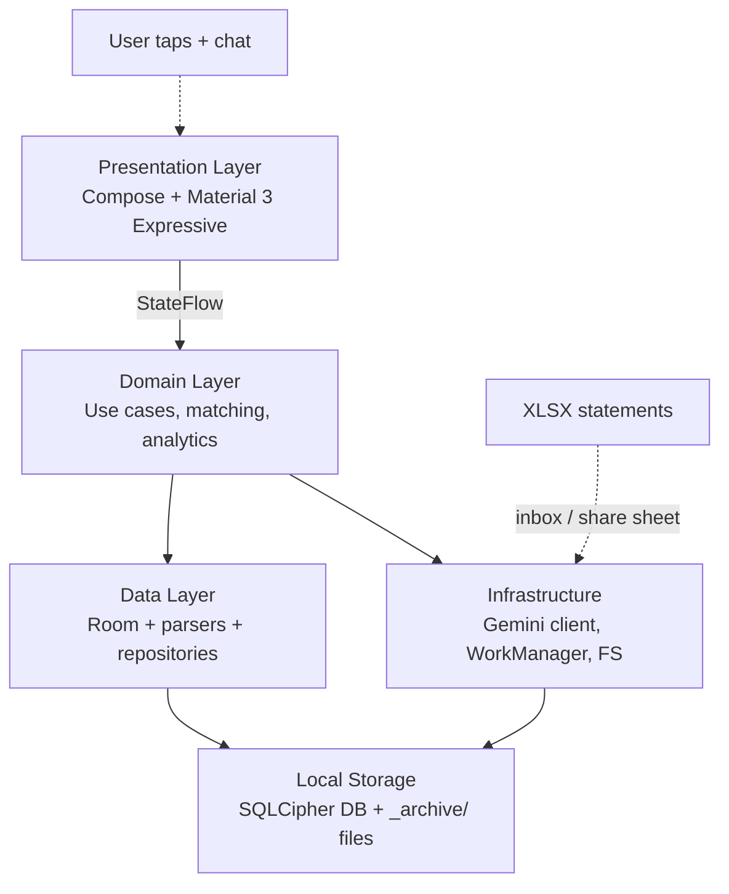

# Stop Vibe Coding. Start Vibe Engineering.

I bank with Bancolombia. Their statement exports are XLSX files where the same workbook mixes US locale (`1,375,571.00`) and Colombian locale (`1.375.571,00`) for two different fields. Credit card statements come in three layouts depending on the network (Visa, Mastercard, Amex), and the multi-currency cards split into `PESOS` and `DOLARES` sheets that share a credit limit. Installment plans show up encoded as `cuotas X/Y` in a single cell. Reversals appear as ghost duplicates with matching authorization codes. Every existing personal finance app either ignores the format or asks for my banking credentials.

So I built [Mintroot](https://github.com/Codestz/Mintroot). Native Android. Kotlin + Jetpack Compose. Encrypted local database. Gemini for classification with a user-supplied key. Forty-eight hours, end to end, one conversation with Opus 4.7 over a 1M-token context window. Signed APK on hour 47.

That's the part that gets attention. It's not the story.

**The story is what happened in the first three hours of that conversation, before a single line of Kotlin existed.** I named the problem. I scoped it. I wrote a list of what I would not build. I sketched ten domain entities. I rejected three features the model offered. By the time the first `BancolombiaSavingsParser` got generated, the architecture was already decided — not by the model, by me, with the model as a thinking partner.

That gap — between "let the model decide" and "decide with the model" — is the difference between vibe coding and vibe engineering. And it is the entire reason this project shipped instead of becoming another half-working repo on my laptop.

<StatBlock
  title="Mintroot, 48 Hours, One Conversation"
  stats={[
    { value: '48h', label: 'End to End' },
    { value: '1', label: 'Conversation' },
    { value: '1M', label: 'Context Window' },
    { value: '10', label: 'Domain Entities' },
    { value: '12', label: 'Milestones' },
    { value: '3', label: 'Statement Layouts' },
    { value: '4', label: 'Matching Layers' },
    { value: '0', label: '`/clear` Calls' },
  ]}
/>

## Vibe Coding vs Vibe Engineering

Let me define both before anyone reads their own definition into them.

**Vibe coding** is prompt-and-pray. You open a chat, describe a thing, accept whatever lands, glue it together, hope it runs. The artifact is the goal. The model is the architect, the developer, and the QA. You are the typist. If it works, you ship. If it doesn't, you regenerate.

**Vibe engineering** treats AI as leverage on the parts of engineering that scale: typing, recall, exploration, refactoring. The judgment — what to build, why, how it fits, what to cut — stays with you. The model writes the code. You own the problem.

<Comparison
  title="Vibe Coding vs Vibe Engineering"
  wrong="Open chat. Describe app. Accept generated files. Run. Doesn't work. Paste error. Accept fix. Run. Add feature. Accept more files. Repeat until ~80% works or you give up. No plan. No scope. No architecture. The model decided what to build because you didn't."
  right="Identify a real problem. Define done. Decide stack, modules, boundaries, data model — in conversation with the model, but you sign off. THEN generate. Every accept is a judgment call, not a default. The model produces code. You produce decisions."
  language="text"
/>

The trap is that vibe coding feels productive. Files appear. The terminal scrolls. Something compiles. Dopamine. But producing artifacts is not the same as solving a problem, and a repo full of generated code that doesn't ship is not engineering — it's just a tour of what the model felt like writing today.

## The Four Moves

Vibe engineering, the way I run it, is four moves in order. I do them with the model in the room, but I do them. Skip any of the first three and you are vibe coding with extra steps.

<ProcessFlow
  title="The Vibe Engineering Loop"
  steps={[
    {
      title: 'Identify',
      description:
        'Name a real, specific pain. Not a market — a problem you or someone you know experiences weekly. If you cannot describe it in one sentence with a named victim, you do not have a project yet. You have a vibe.',
    },
    {
      title: 'Planify',
      description:
        'Write the "not building" list before the "building" list. Decide the scope of rejection first. Constraints, non-goals, and explicit out-of-scope items are what protect the project from the model\'s seductive helpfulness later.',
    },
    {
      title: 'Structure',
      description:
        'Sketch the domain, the modules, the boundaries, the state machines. The architecture should make most future decisions for you. The model proposes; you sign off. This is the part that lets the 1M context window actually pay off.',
    },
    {
      title: 'Create',
      description:
        'Only now does code get written. With full scope, full architecture, and full taste applied to every accept. The model is a very good autocomplete on top of a plan. It is a very bad architect. Give it the plan; let it write.',
    },
  ]}
/>

### 1. Identify

Before any code, I want one sentence: who hurts, and how. Not "an app for finances." A real, irritating, named pain.

Mintroot's pain has a name and a shape. Bancolombia's XLSX exports come in three structural layouts that share almost nothing:

- **Savings** is one sheet, header rows 2–12, movements rows 14+, date format `D/MM` with the year inferred by walking forward through the rows and detecting month wraparounds. Period crosses a calendar quarter. The same statement repeats `Información Cliente` / `Movimientos` header bands every ~50 rows because Excel doesn't paginate well.
- **Credit cards** are one or two sheets named `PESOS` and `DOLARES`. The dollar sheet can be empty but still indicates a multi-currency card. Authorization codes are 6-digit numeric for Visa/Amex but letter-prefixed alphanumeric for Mastercard, and the Mastercard prefix encodes the operation type (`R*` purchase, `C*` payment, `T*` installment). `Pago mínimo` uses US locale; `Pago total` uses Colombian locale; same workbook, same column.
- **Investment funds** use date format `YYYYMMDD` with no separators, and yield accrual is _invisible in the movement table_ — it compounds into the unit value and surfaces only in the Resumen block.

That's a problem with a shape. I can describe done in one line: _import Bancolombia XLSX of any of those three shapes, classify the transactions, and answer questions about my money in plain Spanish._ If I cannot do that in one sentence, I do not start.

> If you can't name the pain in one sentence, you don't have a project. You have a vibe.

### 2. Planify

Scope is a list of what you will not build. I wrote that list first, in hour two of the conversation, and the model never saw a "build the app" prompt until the list was locked.

<ScopeBlock
  title="Mintroot v1 Scope"
  building={[
    'Bancolombia XLSX import (savings, CC multi-currency, funds)',
    'Auto-detection of statement type, account, period',
    'Encrypted Room DB (SQLCipher) on device',
    'Gemini classifier with user-supplied API key',
    'Confidence-aware approval queue (threshold 0.75)',
    'ClassificationCache with EXACT / PREFIX / REGEX patterns',
    'Internal transfer matching (TC payments, FIC contributions)',
    'Installment-plan and reversal modeling',
    'Compose dashboards: net worth, ratios, top merchants',
    'Chat with tool calls against the local DB',
    'CSV + JSON export from day one',
  ]}
  notBuilding={[
    'Other banks (BBVA, Davivienda, etc.)',
    'PDF parsing — XLSX only in v1',
    'Cloud sync, accounts, or backend',
    'Multi-user / couple-finance features',
    'Onboarding wizard — start in the app',
    'Light mode — dark-first',
    'Play Store distribution — APK via GitHub',
    'Hard budgets and goals — reflect, do not coach',
    'Subscription detection as a discrete feature',
    'Push reminders for upcoming payments',
    'Categories editor V1 — auto-classification only',
  ]}
  constraints={[
    'Privacy non-negotiable: bank data never leaves device unencrypted',
    'No subscription, no ads, no broker',
    'Min SDK 31 (Android 12); target latest stable',
    'BYO Gemini key — no infrastructure I have to run',
    '48 hours end to end, signed APK or it does not count',
    'Source files immutable; DB derived; rebuildable from archive',
    'Single Android process, single user, single conversation',
  ]}
/>

The "not building" column is what saved this project. Every time the model suggested a feature — and Opus is generous with suggestions — I checked it against that list. Multi-bank adapter abstraction? Not building. Cloud backup? Not building. Onboarding wizard? Not building. The list outranked the model every time.

This is the move vibe coding skips. When you don't write down what you will not build, the model fills the silence with everything it can imagine, and you end up shipping nothing because you tried to ship everything.

### 3. Structure

Once the scope is locked, I draw the system. Not in detail — bones first. Where the layers are, who owns what data, where the boundaries are, what state machines govern which entities.

The boring rules: `ui/` never imports `data/` directly. `domain/` is pure Kotlin, no Android imports. The Gemini client is one place, so the prompts are one place, so the taxonomy is one place. The parser is mechanical, the classifier is adaptive, and they meet at one interface: `ParsedStatement` → `List<StagedTransaction>`.

This is also where I locked the most decision-dense part of the project: the data model. Ten primary entities, all of them argued for in conversation before any of them got generated.

<FileTree
  items={[
    {
      id: 'root',
      name: 'Mintroot domain entities',
      type: 'folder',
      children: [
        {
          id: 'a',
          name: 'Account              one financial product (savings, CC, fund, loan)',
          type: 'file',
        },
        {
          id: 'b',
          name: 'Statement            one imported file = one period for one account',
          type: 'file',
        },
        {
          id: 'c',
          name: 'Transaction          atomic financial event; signed amount',
          type: 'file',
        },
        {
          id: 'd',
          name: 'Category             user-defined classification of expenses',
          type: 'file',
        },
        {
          id: 'e',
          name: 'Person               counterparty for human transfers (+ aliases)',
          type: 'file',
        },
        {
          id: 'f',
          name: 'InternalTransferLink pair of transactions that are one operation',
          type: 'file',
        },
        {
          id: 'g',
          name: 'ClassificationCache  persistent memory of LLM classifications',
          type: 'file',
        },
        {
          id: 'h',
          name: 'InstallmentPlan      multi-installment CC purchase + lifecycle',
          type: 'file',
        },
        {
          id: 'i',
          name: 'Loan                 external debt (e.g., vehicle) + amortization',
          type: 'file',
        },
        {
          id: 'j',
          name: 'LoanPayment          scheduled vs. actual payment per period',
          type: 'file',
        },
      ],
    },
  ]}
/>

I also wrote down a thesis for the AI half of the system, in hour three, that the entire chat then operated under:

<Callout author="Mintroot design doc, hour 3" role="07-ai-strategy.md" type="quote">
  The LLM is the cognitive engine. It does the thinking. The database is its memory. The user is the
  editor of last resort. The cache means the LLM does not classify the same merchant 200 times — the
  first time it sees `RAPPI COLOMBIA*DL` it produces a structured classification with reasoning, and
  from then on the cache answers.
</Callout>

That single sentence pre-empted dozens of downstream questions. _Should we cache classifications?_ Yes. _Should the LLM ever be called for a transaction it has classified before?_ No, unless the user invalidates. _Should the cache generalize?_ Yes, via periodic generalization passes that propose `PREFIX_MATCH` and `REGEX_LEARNED` entries. _Should user corrections be sticky?_ Yes — `user_validated` is the only immutable flag in classification. All of that flowed from one design principle, decided once.

This is where the 1M context window starts paying for itself. The thesis I wrote at hour three was still loaded at hour thirty. The model did not reinvent the cache shape in a fresh session because there was no fresh session. Every new file got generated with full awareness of every previous file. That's not magic — it's what happens when you stop fragmenting context across chats.

### 4. Create

Only now does code get written. And here's the part vibe coders miss: writing code is the easy half. By the time I asked for the first `BancolombiaSavingsParser`, the model didn't need much. It had the scope, the architecture, the taxonomy, the constraints. The prompt was three lines. The output was almost shippable.

<Terminal
  title="The actual first generation prompt"
  lines={[
    {
      type: 'input',
      prompt: 'me>',
      content: 'Generate BancolombiaSavingsParser per the BankAdapter contract.',
    },
    {
      type: 'input',
      prompt: 'me>',
      content:
        'Use Apache POI poi-ooxml-lite. Handle Colombian-locale amount strings (1.234.567,89).',
    },
    {
      type: 'input',
      prompt: 'me>',
      content: 'Walk rows forward to infer year on D/MM dates; skip repeated header bands.',
    },
    {
      type: 'input',
      prompt: 'me>',
      content: 'Accept rows with raw_description "0" — pass through, do not drop.',
    },
    { type: 'divider', content: '' },
    { type: 'comment', content: 'Output: ~140 lines of Kotlin, compiled first try.' },
    {
      type: 'comment',
      content: 'Not because the model was clever — because the question was specific.',
    },
    {
      type: 'comment',
      content: 'Specifics flowed from hours of identify/planify/structure work upstream.',
    },
  ]}
/>

The model is a very good autocomplete on top of a plan. It is a very bad architect. Ask "build me a finance app" and you get a vibe. Ask "implement this contract, with these constraints, against this fixture, per the architecture we agreed at hour three" and you get code.

## What the 1M Context Window Actually Did

Now the part everyone wants. The single-conversation, 1M-token thing.

It did not write better code. Opus writes the same Kotlin in a 200K session as it does in a 1M session. What 1M gave me was **continuity** — the elimination of every micro-tax that fragments AI development across sessions.

<TokenComparison
  title="Same project, two delivery models"
  approaches={[
    {
      name: 'Classic multi-session',
      color: 'red',
      steps: [
        { action: 'Session 1: scope + architecture', tokens: 40000, time: '3h' },
        { action: 'Re-prime session 2 with summary', tokens: 12000, time: '20m' },
        { action: 'Session 2: parsers + Room schema', tokens: 80000, time: '6h' },
        { action: 'Re-prime session 3 (drift starts)', tokens: 15000, time: '30m' },
        { action: 'Session 3: classifier + cache + chat', tokens: 90000, time: '8h' },
        {
          action: 'Re-prime session 4 (now contradicting earlier decisions)',
          tokens: 18000,
          time: '40m',
        },
        { action: 'Session 4: UI + WorkManager + polish', tokens: 100000, time: '10h' },
      ],
      totalTokens: 355000,
      totalCost: '~3-5 days',
      successRate: 'Architectural drift by session 3',
    },
    {
      name: 'Single-shot 1M context',
      color: 'green',
      steps: [
        { action: 'Hours 1-3: identify + planify + structure', tokens: 40000, time: '3h' },
        { action: 'Hours 4-20: parsers, schema, classifier, cache', tokens: 280000, time: '17h' },
        { action: 'Hours 21-30: matching, chat, UI, signed APK', tokens: 180000, time: '10h' },
        { action: 'Zero re-primes. Zero summaries. Zero drift.', tokens: 0, time: '0' },
      ],
      totalTokens: 500000,
      totalCost: '~48h end to end',
      successRate: 'Decisions from hour 3 still load-bearing at hour 30',
    },
  ]}
/>

The big number is not the token count. The big number is the zero in "zero re-primes." Every session boundary in classic AI development is a place where context decays, decisions get re-explained badly, and the model gradually starts contradicting itself. The 1M context window does not make the model smarter. It removes the failure mode where the model forgets what it agreed to four hours ago.

That said: 1M context is not a license to vibe code longer. If your first three hours are bad, the next twenty-seven are bad too, with full fidelity. The window is a multiplier. It multiplies whatever you put in.

## The Moments I Said No

The cleanest signal that you are vibe engineering instead of vibe coding is how often you reject the model's suggestions. Mine, for this project, in order:

<DecisionLog
  title="Real Decisions from the Mintroot Conversation"
  decisions={[
    {
      proposal: 'Want me to add a multi-bank adapter pattern so this is extensible from day one?',
      verdict: 'rejected',
      reasoning:
        'Bancolombia only. The BankAdapter interface exists, but only one implementation. Premature abstraction is how solo projects die. If a second bank ever happens, extract then.',
    },
    {
      proposal: 'I can add user accounts with biometric auth so multiple people can use the app.',
      verdict: 'rejected',
      reasoning:
        'The device is the auth. Adding accounts means adding sync means adding a backend means I am building a SaaS instead of a tool. The single-user constraint is what makes the privacy model work.',
    },
    {
      proposal:
        'Should I parallel-ingest SMS notifications and reconcile against monthly statements for near-real-time visibility?',
      verdict: 'rejected',
      reasoning:
        'Tiny-LLM accuracy on terse Bancolombia SMS bodies is not worth the complexity, and dropping it lets the app sidestep the READ_SMS restricted permission entirely. M6 stays in the docs as a tombstone for milestone numbering stability.',
    },
    {
      proposal: 'Want me to write parser tests first, TDD-style, before generating the parser?',
      verdict: 'deferred',
      reasoning:
        'Test-first on a parser you have never built against a format you have never parsed is theater. See one real XLSX end-to-end first, then anonymize it into a fixture, then lock the test suite. Tests follow the first working slice, not precede it.',
    },
    {
      proposal:
        'I notice your RecurringDetector and TransferMatcher share scoring logic — extract a base class?',
      verdict: 'deferred',
      reasoning:
        'Two is a coincidence. Show me the third caller first. Abstractions extracted at N=2 are wrong 80% of the time; abstractions extracted at N=3 are wrong 20%. Wait.',
    },
    {
      proposal:
        'Should I add a "polisher" 1B model to rewrite raw glosas into clean merchant names before classification?',
      verdict: 'rejected',
      reasoning:
        'It hallucinated on terse Bancolombia descriptions. Replaced by a structural DescriptionNormalizer that uppercases and strips account masks. The LLM does cognition; structural normalization does not need cognition.',
    },
    {
      proposal: 'The Bancolombia "Tapa_Resumen" file looks parseable — should I add a handler?',
      verdict: 'rejected',
      reasoning:
        'Every figure in those summary files is already derivable from the per-account statements. Parsing them is double-counting risk for zero added information. Archive them to _archive/unhandled/, log to ImportLog, do not parse.',
    },
    {
      proposal:
        'Should I auto-fetch the day TRM from a public API when matching multi-currency CC payments?',
      verdict: 'rejected',
      reasoning:
        'TRM is derivable from the statement itself — the DOLARES sheet carries `VR MONEDA ORIG <COP>` annotation rows, and savings/CC payment pairs give the effective rate. Statement-derived TRM keeps the system fully reconstructable from source files. No network. Ever.',
    },
  ]}
/>

<Comparison
  title="The same suggestion, vibe coded vs vibe engineered"
  wrong="Model: 'Want me to add a multi-bank adapter pattern?' Vibe coder: 'Sure, do it.' Result: AbstractBankParser, BankParserFactory, BankRegistry, three interface levels, one concrete implementation, twelve files of speculative architecture for banks that will never exist."
  right="Model: 'Want me to add a multi-bank adapter pattern?' Vibe engineer: 'BankAdapter interface, Bancolombia only. If a second bank ever happens, extract then.' Result: one parser per layout, one bank, shipped — and the extension point is there for future contributors without anyone paying for it today."
  language="text"
/>

Every "no" was a feature. Saying no is engineering. Saying yes to everything the model proposes is dictation.

## Where the Plan Earned Its Keep

The structural decisions made in hours 1–3 paid off everywhere in hours 4–48. A few of the moments where I was glad past-me had decided:

- **`Account.metadata_json` instead of more columns.** Credit cards have cupo and statement cycle dates; funds have unit value and rentability; loans have rate and term. Different fields per type. Stuffing them as columns produces a sparse, ugly schema; using a typed JSON column kept the relational schema clean. Decided at hour two, never revisited.
- **`source_file_hash` for dedup.** Every import re-checks the SHA-256 against existing `Statement.source_file_hash`. Re-importing the same XLSX is a no-op. This is the kind of correctness property you cannot retrofit after the fact — it has to be in the schema on day one.
- **Single signed `Transaction.amount`.** Two-column debit/credit schemas are double-entry accounting legacy that does not suit a personal-app DB. A single signed decimal is unambiguous and simpler. Decided once, propagated to every metric query for free.
- **`classification_history_json` as append-only log.** Every re-classification appends to the transaction's own audit trail. Five years from now, the user can ask "why is this categorized as Mercado?" and get a chain of decisions, including which prompt version classified it and which user correction overrode it. The cost: one JSON column. The value: auditability forever.
- **Four-layer matching algorithm.** High-confidence auto-match → probable match (review) → LLM arbitration → user confirmation. Designed once, used by both internal transfer detection and loan payment matching. One algorithm, two callers, zero duplication.

None of these were decisions the model made for me. They were decisions I made with the model. That distinction is the entire point.

## Useful Is the Only Bar

Here's the part I want to land hard. **It does not matter whether Mintroot is useful to the community.** It is useful to me. I bank with Bancolombia. I have real XLSX files. I have real money to track. I will use this app every month. If three other people on the internet also use it, that is gravy. If zero do, the project still succeeded the moment I imported my first statement and saw a year of spending categorized in 90 seconds.

This is the part that gets lost in the "AI lets you ship faster" discourse. Speed is not the unlock. Speed is just the visible part. The actual unlock is that **AI lowers the activation energy for solving real, specific, personal problems** — the long tail of pain points that were never going to justify a startup but absolutely justify a weekend.

Vibe coders build apps that already exist, badly, because the model defaults to averages. Vibe engineers build apps that don't exist yet, well enough to use, because they brought the problem and used the model for leverage.

<Terminal
  title="The metric that matters"
  lines={[
    { type: 'comment', content: 'Bad metric: lines of code generated' },
    { type: 'comment', content: 'Bad metric: stars on the repo' },
    { type: 'comment', content: 'Bad metric: was this faster than writing it by hand' },
    { type: 'divider', content: '' },
    { type: 'success', content: 'Good metric: did you use it on Monday?' },
    {
      type: 'success',
      content: 'Good metric: is the problem from week one still solved at week ten?',
    },
    { type: 'success', content: 'Good metric: would you ship it again from scratch tomorrow?' },
  ]}
/>

If the answer to any of those is no, you did not engineer anything. You generated something.

## What This Looks Like as a Practice

If you want to try this on your next project, the loop is small enough to write on a sticky note:

1. **Find a problem you have this week.** Not a market. A pain. Your own, preferably. Name the victim and the irritation in one sentence.
2. **Write the "not building" list before the "building" list.** The scope you reject is the scope you ship. Lock constraints early; the model will respect them if they exist.
3. **Decide the architecture in conversation, but sign off yourself.** Sketch the modules, the boundaries, the state machines, the data model. The model proposes; you dispose. Three hours of design saves three days of regret.
4. **Only after the first three: generate code.** With full context. With taste applied to every accept. Treat every "do you want me to also..." as a budget decision.
5. **Reject the seductive abstraction.** Two callers is a coincidence; wait for three. Premature factories are how solo projects collapse.
6. **Ship the smallest thing that works on Monday.** Iterate from there or don't. Either is fine. Useful beats complete every time.

The 1M context window is a force multiplier on this loop. It is not a substitute for it. If you walk in without a plan, you walk out with a longer pile of code that still does not solve your problem — just generated with more continuity.

## The Pitch

Mintroot exists because I needed it, scoped it ruthlessly, structured it before generating it, and then used Opus 4.7's 1M context window to hold the whole thing in one conversational head for two days. Not because I am special. Because the four moves are simple and the model is patient.

**Vibe coding produces artifacts. Vibe engineering produces solutions.**

The model will happily do either. The choice is yours, every conversation, every accept, every "do you want me to also..." that lands in your chat. Most of those should be no. Most of the rest should be later. The few that survive that filter are the ones worth typing yes to.

Go solve something specific. Bring the problem. Let the model do the typing.

Mintroot is open source on [GitHub](https://github.com/Codestz/Mintroot). MIT licensed. Bring your own Gemini key. Built in 48 hours, one conversation, zero vibes.
