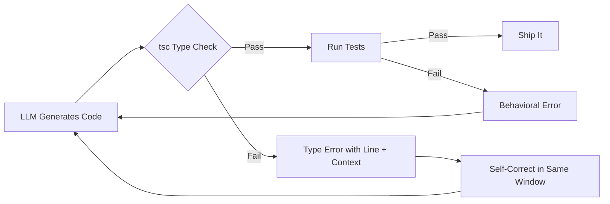
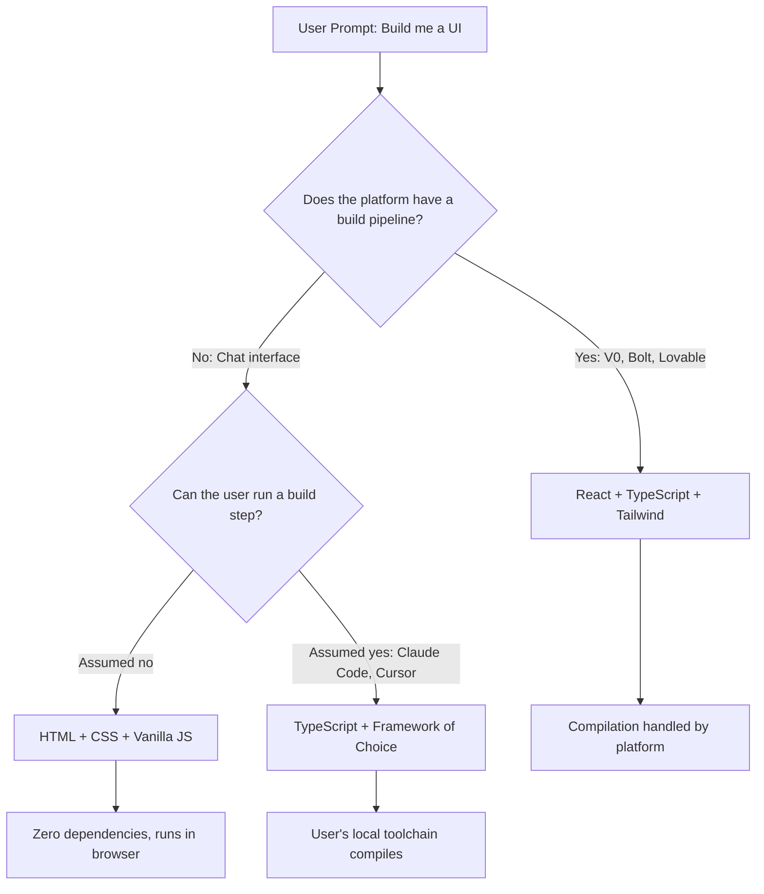

Open your AI coding tool. Type _"build me a landing page with a contact form."_ Don't specify a language. Don't specify a framework.

What you get back depends entirely on **where you asked**.

<Comparison
  title="The Same Prompt, Two Different Worlds"
  wrong="Claude Desktop / Gemini Chat / ChatGPT: Here's an HTML file with inline CSS and vanilla JavaScript. Save it as index.html and open it in your browser. No build step. No dependencies. Just works."
  right="V0 / Bolt / Lovable / Google AI Studio: Here's a React + TypeScript component using Tailwind CSS. It's already running in the preview pane. Hot reload is active. Type safety is enforced."
  language="output"
/>

Two defaults. Same model underneath. Completely different outputs. **This isn't random -- it's the output of a deeply mechanical set of forces** driven by runtime constraints, compilation pipelines, training dynamics, and something GitHub recently called a "convenience loop."

The question isn't just _"why TypeScript?"_ It's _"why does the tool's delivery mechanism dictate the entire technology stack?"_

## The Training Data Problem: LLMs Are Regurgitation Machines with Extrapolation

To understand why AI tools default to TypeScript, you first need to understand how LLMs learn to write code. They don't reason about programming languages the way a human compiler engineer would. They learn statistical patterns from massive corpora of public code. The better a language is represented in that corpus, the better the model's output quality, pattern matching, and error recovery will be.

<Callout type="quote" author="Anders Hejlsberg" role="Lead Architect, TypeScript">
  AI's ability to write code in a language is proportional to how much of that language it's seen.
  They're big regurgitators, with some extrapolation.
</Callout>

That's not an insult -- it's an architectural description. And what has every major LLM seen _most_ of?

JavaScript and Python, historically. But as of August 2025, TypeScript overtook both to become the **#1 most-used language on GitHub**.

<StatBlock
  title="TypeScript on GitHub -- August 2025"
  stats={[
    { value: '#1', label: 'Most-Used Language' },
    { value: '66%', label: 'Year-over-Year Growth' },
    { value: '2.6M', label: 'Monthly Contributors' },
    { value: '10yr', label: 'Biggest Shift in a Decade' },
  ]}
/>

The corpus shifted. And the models follow the corpus.

When an AI tool doesn't know what language you want, it defaults to the one where it has the **highest confidence**, the richest pattern library, and the lowest probability of generating broken output. For web-adjacent tasks right now, that's TypeScript.

## The Type System as a Structured Prompt

Here's the part most people miss.

TypeScript doesn't just benefit LLMs through training data volume. It benefits them through **structural information density**. When a model reads TypeScript code, every function signature, every interface definition, every generic constraint is a piece of machine-readable contract.

<Comparison
  title="What the Model Actually Sees"
  wrong="async function fetchUserOrders(userId, options) -- The model has to guess: What is userId? A string? A number? A branded type? What shape does options have? What does the function return? All of this must be inferred from naming conventions and surrounding context."
  right="async function fetchUserOrders(userId: UserId, options: FetchOptions): Promise<OrderResult[]> -- The model knows exactly: userId is a branded type (not a raw string), options has a defined shape, and the return is an array of OrderResult wrapped in a Promise. Zero guessing required."
  language="typescript"
/>

The TypeScript version tells the model: what kind of argument `userId` is (a branded type, probably not a raw string), what shape `options` expects, and what structure the return array contains. The model doesn't need to _infer_ this from variable naming conventions or surrounding code. **The type system is literally an in-line specification.**

This maps directly to how transformers work. They predict the most probable next token given context. Richer semantic context means higher probability of correct prediction means better code output. TypeScript's type system is, in a very real sense, **structured context injection built into the language syntax itself**.

<StatBlock
  title="LLM Code Generation -- Error Analysis (2025)"
  stats={[
    { value: '94%', label: 'Errors are Type-Check Failures' },
    { value: '6%', label: 'Logic / Runtime Errors' },
  ]}
/>

Static typing doesn't just catch errors -- for AI-generated code specifically, **it defines the entire boundary between working and broken.**

## The Compiler as a Free Feedback Loop

LLMs produce code in iterations. Even the best AI coding assistants operate in a guess-check-refine loop. The question is: what is the checking mechanism?

In a dynamically typed language, the feedback mechanism is **runtime**. You write the code, you run it, something explodes, you feed the error back to the model. That cycle might be 10-30 seconds per iteration, longer if the bug is a silent logic error that only surfaces in specific execution paths.

In TypeScript, the feedback mechanism is **compile-time**.



The TypeScript compiler acts as a constant, zero-latency validator. Type errors surface immediately, they're localized to specific lines, and they carry enough semantic information for a model to self-correct **in the same context window**.

<TokenComparison
  title="Feedback Loop Cost: Dynamic vs Static Typing"
  approaches={[
    {
      name: 'Dynamic (JS/Python)',
      color: 'red',
      steps: [
        { action: 'Generate code', tokens: 800, time: '1.2s' },
        { action: 'Execute at runtime', tokens: 0, time: '10-30s' },
        { action: 'Parse runtime error', tokens: 400, time: '0.5s' },
        { action: 'Regenerate with fix', tokens: 800, time: '1.2s' },
        { action: 'Execute again (maybe works)', tokens: 0, time: '10-30s' },
      ],
      totalTokens: 2000,
      totalCost: '20-60s per iteration',
      successRate: '~70%',
    },
    {
      name: 'Static (TypeScript)',
      color: 'green',
      steps: [
        { action: 'Generate code', tokens: 800, time: '1.2s' },
        { action: 'tsc type check', tokens: 0, time: '0.5s' },
        { action: 'Self-correct from type error', tokens: 300, time: '0.4s' },
        { action: 'Run tests', tokens: 0, time: '2-5s' },
      ],
      totalTokens: 1100,
      totalCost: '2-7s per iteration',
      successRate: '~94%',
    },
  ]}
/>

This matters because **the tighter the feedback loop, the fewer iterations needed to converge on correct code**. TypeScript's type system plus a modern test runner creates a dual feedback architecture: static typing catches structural mistakes in milliseconds, tests catch behavioral mistakes in seconds. Neither exists in raw JavaScript.

From a systems perspective: **TypeScript compresses the iteration cycle.** For an AI coding tool trying to maximize output quality per token spent, that compression is extremely valuable.

## Ecosystem Gravity and Framework Defaults

This is the more mundane but equally important force. TypeScript doesn't just win on theoretical merits -- it wins because the **entire modern web framework ecosystem scaffolds in TypeScript by default**.

<Terminal
  title="What 'npx create' Looks Like in 2026"
  lines={[
    { type: 'input', prompt: '$', content: 'npx create-next-app@latest' },
    { type: 'output', content: 'Would you like to use TypeScript? › Yes (default)' },
    { type: 'divider', content: '' },
    { type: 'input', prompt: '$', content: 'npm create astro@latest' },
    { type: 'output', content: 'How would you like to set up TypeScript? › Strict (default)' },
    { type: 'divider', content: '' },
    { type: 'input', prompt: '$', content: 'npx create-vite@latest' },
    { type: 'output', content: 'Select a variant: › TypeScript (default)' },
    { type: 'divider', content: '' },
    { type: 'input', prompt: '$', content: 'ng new my-app' },
    { type: 'output', content: 'Angular has always been TypeScript. There is no option.' },
    { type: 'success', content: 'Every major framework. TypeScript by default.' },
  ]}
/>

Next.js, Astro, Angular, NestJS, Vite, the AWS CDK, Pulumi -- all TypeScript by default. When an AI tool is trained on recent GitHub code, it's overwhelmingly reading TypeScript project structures, TypeScript configuration files, TypeScript component patterns.

If you ask it to scaffold a new project without specifying a language, it's going to reproduce the most statistically common pattern it's seen. Which is, now, TypeScript.

<Callout type="info">
  This is a compounding effect. Frameworks default to TypeScript. Developers write TypeScript. More
  TypeScript on GitHub. Models train on TypeScript. Models default to TypeScript. Developers are
  more productive with AI in TypeScript. More TypeScript gets written. The loop feeds itself.
</Callout>

## The Two Defaults: Runtime Decides Everything

Here's where it gets interesting. The forces above -- training data, type system density, compiler feedback, ecosystem gravity -- all explain why TypeScript dominates. But they don't explain why Claude Desktop gives you a single HTML file when V0 gives you a full React + TypeScript component for the **exact same prompt**.

The answer isn't the model. It's the **runtime**.

### The App Builders: React + TypeScript by Default

Platforms like V0, Bolt, Lovable, and Google AI Studio aren't just chat interfaces -- they're **full development environments with embedded build pipelines**. When you type a prompt into Bolt, here's what's actually running behind the scenes:

<ProcessFlow
  title="What Happens When You Prompt an App Builder"
  steps={[
    {
      title: 'Prompt Received',
      description:
        'The model interprets your request in the context of a React + TypeScript project scaffold that already exists.',
    },
    {
      title: 'Code Generated as TSX',
      description:
        'The LLM outputs TypeScript React components because the platform has pre-configured the project as a Vite/Next.js app with TypeScript strict mode.',
    },
    {
      title: 'Bundler Compiles in Real-Time',
      description:
        'Vite (or a similar bundler) runs in the background. TypeScript is transpiled, JSX is transformed, imports are resolved -- all in milliseconds.',
    },
    {
      title: 'Hot Module Replacement',
      description:
        'The preview iframe updates instantly. The user sees the result without refreshing, without a terminal, without installing anything.',
    },
    {
      title: 'Type Errors Feed Back to the Model',
      description:
        'If tsc catches an error, the platform feeds it back to the LLM automatically. The model self-corrects before you ever see the bug.',
    },
  ]}
/>

The platform **can afford** React + TypeScript because it ships the entire compilation pipeline. You never run `npm install`. You never configure `tsconfig.json`. You never touch a terminal. The build step is invisible -- but it's there, and it's doing the heavy lifting that makes TypeScript viable.

This is why these platforms default to React specifically. React's component model maps almost perfectly to how LLMs think about UI generation:

```typescript
// A component is a self-contained, composable unit
// The model can generate one component at a time
// Props are a typed contract between components
// The tree structure maps to the DOM hierarchy

interface ContactFormProps {
  onSubmit: (data: FormData) => Promise<void>;
  fields: FormField[];
  submitLabel?: string;
}

export function ContactForm({ onSubmit, fields, submitLabel = 'Send' }: ContactFormProps) {
  // Self-contained logic, typed inputs, predictable output
  // This is exactly the kind of structure an LLM excels at generating
}
```

<Callout type="tip">
  The component model is a natural fit for token-by-token generation. Each component is a bounded
  context with typed inputs and predictable outputs -- exactly what transformers are optimized to
  produce. React's composability means the model can build complex UIs piece by piece without losing
  coherence.
</Callout>

### The Chat Interfaces: HTML + CSS Because There's No Build Step

Now contrast that with Claude Desktop, Claude Web, Gemini Chat, or ChatGPT. These tools have a fundamentally different constraint: **the output has to work the moment the user copies it**.

<Terminal
  title="Claude Desktop -- The Reality"
  lines={[
    { type: 'input', prompt: '>', content: 'Build me a landing page with a contact form' },
    { type: 'divider', content: '' },
    { type: 'output', content: "Here's a complete landing page. Save this as index.html:" },
    { type: 'divider', content: '' },
    { type: 'output', content: '<!DOCTYPE html>' },
    { type: 'output', content: '<html lang="en">' },
    { type: 'output', content: '  <style> /* All styles inline */ </style>' },
    { type: 'output', content: '  <script> /* Vanilla JS, no imports */ </script>' },
    { type: 'output', content: '</html>' },
    { type: 'divider', content: '' },
    { type: 'success', content: 'Zero dependencies. Zero build step. Open in browser.' },
  ]}
/>

There's no Vite running in the background. There's no `node_modules`. There's no TypeScript compiler. The user is going to take that output and either:

- <Icon name="FileCode" size={16} className="text-primary" /> Save it as a `.html` file and
  double-click it
- <Icon name="Globe" size={16} className="text-primary" /> Paste it into CodePen or JSFiddle
- <Icon name="Terminal" size={16} className="text-primary" /> Serve it with `python -m http.server`

In every case, **the code must execute with zero compilation**. That constraint eliminates TypeScript entirely -- browsers don't run `.ts` files. It eliminates JSX -- browsers don't parse `<Component />` syntax. It eliminates npm imports -- there's no package resolution.

What's left? The web's native stack: **HTML, CSS, and vanilla JavaScript.**

### The Decision Tree

This isn't a preference. It's a constraint-driven decision:



Notice the third branch: tools like **Claude Code and Cursor** sit in the middle. They have access to the user's local terminal and file system. They _know_ if you have Node.js installed, if there's a `package.json`, if TypeScript is configured. So they default to TypeScript + whatever framework your project already uses -- because they can verify the build pipeline exists.

<StatBlock
  title="Default Output by Tool Category"
  stats={[
    { value: 'React+TS', label: 'App Builders (V0, Bolt)' },
    { value: 'HTML/CSS', label: 'Chat Interfaces (Claude, GPT)' },
    { value: 'Project TS', label: 'Code Editors (Cursor, Claude Code)' },
  ]}
/>

The model's "preference" for TypeScript hasn't changed across any of these. What changes is the **delivery constraint**. A React component with TypeScript is objectively better output -- more maintainable, more composable, more type-safe. But "better" doesn't matter if the user can't run it. And a single HTML file that opens in any browser, on any machine, with zero setup? That's a different kind of "better."

<Callout type="info">
  This is the same trade-off that's existed in web development for decades: the compiled,
  toolchain-heavy approach vs. the zero-dependency, view-source approach. AI tools didn't invent
  this tension -- they just made it visible by forcing the decision on every single prompt.
</Callout>

## The Convenience Loop: How AI is Killing Language Innovation

This brings us to the most uncomfortable implication of all of this.

GitHub's Octoverse 2025 report identified a pattern they called the **"convenience loop."** It works like this:

<ProcessFlow
  title="The Convenience Loop -- GitHub Octoverse 2025"
  steps={[
    {
      title: 'AI Tools Work Better',
      description:
        'Models produce higher-quality output in languages with more training data. TypeScript, Python, Go, and Rust dominate.',
    },
    {
      title: 'Developers Notice',
      description:
        'Productivity spikes when the AI assistant actually works. Autocomplete hits, generated code compiles, suggestions are contextually accurate.',
    },
    {
      title: 'Developers Choose Those Languages',
      description:
        "Given the choice between a language where AI helps and one where it doesn't, developers pick the one that makes them faster.",
    },
    {
      title: 'More Code Gets Written',
      description:
        'The chosen languages accumulate more repositories, more examples, more patterns on GitHub.',
    },
    {
      title: 'Models Train on More Data',
      description:
        'Next training run ingests the new corpus. The dominant languages get even more representation.',
    },
    {
      title: 'AI Tools Get Even Better',
      description:
        'More training data means better pattern matching, fewer hallucinations, higher confidence scores. Go back to step 1.',
    },
  ]}
/>

The winners of this loop are already clear: **TypeScript, Python, Go, Rust.** The losers are any new or niche language without a large existing corpus.

It doesn't matter how elegant the language design is, how much better the memory model, how much faster the compile times. **If the AI assistant goes quiet when you switch to it, developers will switch back.**

<Callout type="quote" author="Anders Hejlsberg" role="Lead Architect, TypeScript">
  If your language doesn't have millions of code examples out there, Copilot won't be much help. And
  when Copilot doesn't help, developers pick something else.
</Callout>

This is a genuinely new pressure on programming language adoption that didn't exist before 2022. The metric that used to matter was _"how good is the language?"_ The metric that increasingly matters is _"how much has the model seen of it?"_

## What About Python?

Python is the obvious counterexample. It dominates AI/ML work -- roughly half of all new AI repositories on GitHub start in Python, and it's nowhere near declining for model training, data pipelines, and research.

But the key distinction is **what kind of coding** we're talking about.

<Comparison
  title="Python vs TypeScript in the AI Ecosystem"
  wrong="Python leads everything. It's the #1 AI language, period. If you're doing anything with AI, you should be writing Python -- training models, building apps, creating APIs, shipping SaaS features."
  right="Python leads for building and training AI models. TypeScript leads for building with AI models -- RAG pipelines, API wrappers, SaaS features, application-layer AI work. As the ecosystem matures from 'training AI' to 'building with AI', TypeScript's gravitational pull increases."
  language="ecosystem"
/>

As the ecosystem matures and more developers are building _with_ AI rather than _training_ AI, TypeScript's gravitational pull increases. The question "what language does an AI tool default to?" is really the question "what language does an AI tool see most of, in the context of application development?"

And that answer is shifting toward TypeScript faster than most people realize.

## The Short Version

Strip everything else away. There are two defaults, and both are mechanically determined:

<StatBlock
  title="The Formula -- Why TypeScript"
  stats={[
    { value: 'Abundance', label: '#1 in Training Corpora' },
    { value: 'Signal', label: 'Types = Structured Context' },
    { value: 'Speed', label: 'Compile-Time Feedback' },
    { value: 'Gravity', label: 'Every Framework Defaults to TS' },
  ]}
/>

<StatBlock
  title="The Fork -- What Decides the Output"
  stats={[
    { value: 'Runtime', label: 'Does a Build Pipeline Exist?' },
    { value: 'Delivery', label: 'Can the User Compile?' },
    { value: 'Context', label: 'Chat vs IDE vs App Builder' },
  ]}
/>

**Abundance** x **Signal Density** x **Feedback Speed** x **Ecosystem Defaults** = the model always _wants_ to generate TypeScript. But the delivery mechanism overrides that preference. If there's a build pipeline, you get React + TypeScript. If there's no compilation step, you get HTML + CSS + vanilla JS. If you're in a code editor with a local toolchain, you get TypeScript in whatever framework you're already using.

It's not a preference. **It's physics constrained by plumbing.**

The next time an AI tool hands you a single HTML file when you expected React, or a TypeScript component when you expected something simpler -- you're watching a large language model navigate the intersection of statistical confidence and runtime constraints. It's doing exactly what it was trained to do, filtered through what it knows you can actually execute.

And the convenience loop ensures that tomorrow, both defaults will be even more entrenched than they are today.

---

## References

1. [GitHub Octoverse 2025: TypeScript rises to #1](https://github.blog/news-insights/octoverse/octoverse-a-new-developer-joins-github-every-second-as-ai-leads-typescript-to-1/) -- GitHub's annual developer report documenting TypeScript's 66% YoY growth, 2.6M monthly contributors, and the "convenience loop" pattern driving language adoption.

2. [TypeScript's Rise in the AI Era: Insights from Anders Hejlsberg](https://github.blog/developer-skills/programming-languages-and-frameworks/typescripts-rise-in-the-ai-era-insights-from-lead-architect-anders-hejlsberg/) -- GitHub Blog interview where Hejlsberg describes LLMs as "big regurgitators with some extrapolation" and explains why AI tools create a vicious cycle against new language adoption.

3. [Anders Hejlsberg: "AI is a big regurgitator of stuff someone has done"](https://devclass.com/2026/01/28/typescript-inventor-anders-hejlsberg-ai-is-a-big-regurgitator-of-stuff-someone-has-done/) -- DevClass coverage of Hejlsberg's remarks on how training corpus size directly determines AI code generation quality.

4. [LLM Code Generation Error Analysis (ICSE 2025)](https://wangzhijie.me/assets/pubs/icse25-llmcodeerrors.pdf) -- Academic study finding that 94% of compilation errors in LLM-generated code are type-check failures.

5. [V0 by Vercel](https://v0.app) -- AI app builder with embedded React + TypeScript runtime and live preview.

6. [Bolt by StackBlitz](https://bolt.new/) -- Browser-based AI agent for full-stack web application development.

7. [Lovable](https://lovable.dev) -- Full-stack AI application platform generating real, editable source code from prompts.

8. [Google AI Studio](https://aistudio.google.com) -- Google's web IDE for prototyping with Gemini models.
